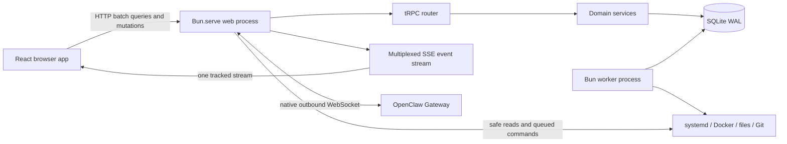

# Greenfield Rewrite Blueprint

> **Status:** implementation started. The rewrite is built beside the current production
> implementation and targets a fresh database with no compatibility layer.
>
> **Audit date:** 2026-08-03. Package versions and the Bun canary snapshot in this document
> are point-in-time facts and must be rechecked at every candidate promotion.

## Implementation Progress

### 2026-08-03 — Phase 0 started

- Dashboard task [#396](/tasks/396) tracks the rewrite foundation.
- The current codebase, deployment/runtime tooling, lint configuration, package graph, and
  approved blueprint were re-audited before implementation changes.
- The latest official ARM64 Bun canary was rechecked both at implementation start and again
  before the foundation PR. Bun replaced the artifact during the work, so the selected candidate
  advanced to `1.4.0-canary.1+1f447a73e`, SHA-256
  `bed2a17f337d44d00dc26e9ec7a456cc521af4a9e82e02028cc69dddc696437d`. The running production
  release remains on its immutable cached runtime until a verified release activation.
  `.bun-version` pins the full qualified revision
  `1f447a73ebf6a86912a3f11b00bd6fbb5f82b6c0`; CI resolves that SHA rather than the moving
  `canary` channel.
- The host bootstrap runtime was upgraded to the same selected revision only after the focused
  candidate gates passed. Its installed binary is byte-identical to the downloaded and
  checksum-verified qualification binary. The current production release and both production
  services were not restarted or changed.
- Phase 0 qualification runs sequentially with host load, available memory, and swap
  checked around every resource-heavy command. No build, install, or broad test gate runs
  while the VPS is already saturated.
- The greenfield dependency baseline is installed in the worktree: tRPC `11.18.0`, Drizzle
  ORM/Kit `1.0.0-rc.4`, `@valibot/to-json-schema` `1.7.1`, and the Bun-compatible
  `eventsource` `4.1.0` test ponyfill. `@valibot/to-json-schema` is build-time documentation
  tooling, not part of tRPC validation. Bun 1.4 does not expose a global `EventSource`, so the
  ponyfill is test-only; browsers use their native implementation. Both packages are
  development dependencies and stay out of the production runtime and browser bundle.
- The same install refreshed `oxlint-config-presets` to `0.1.18` and
  `@microlink/react-json-view` to `1.31.26`. The lockfile was regenerated with the qualified
  Bun canary. No production service or release was changed.
- The first executable qualification slice passes on the exact candidate revision: seven Bun
  tests across runtime identity, Drizzle/Bun SQLite, and tRPC Fetch/SSE. The database evidence
  covers strict SQLite tables, check/foreign-key/partial-unique/index constraints, synchronous
  transactions and rollback, prepared and parameterized raw SQL, native-client access,
  Valibot schemas generated from Drizzle, and an index-backed query plan. New SQLite setup code
  uses the current `Database.run()` API rather than Bun's deprecated `Database.exec()` alias.
- The tRPC evidence covers validated queries and mutations through `Bun.serve`, tracked SSE
  delivery through the official `httpSubscriptionLink`, a server-forced reconnect, resume from
  the last event ID without duplicate delivery, bounded per-subscriber buffering, and subscriber
  cleanup after client abort. `eventsource` is injected only into the Bun-side client test.
- These focused gates currently pass on the exact candidate: qualification and greenfield
  TypeScript, Oxlint with typed rules, Oxfmt, deterministic documentation generation,
  Drizzle migration-graph validation, 7/7 qualification tests, 12/12 greenfield server tests,
  and 4/4 documentation tests. Direct event-feed tests also prove gap-free replay to live
  handoff and deterministic failure/cleanup when a slow subscriber exceeds its queue budget.
  Reverse-proxy behavior, rolling-release reconnect, and sustained slow-consumer pressure remain
  open Phase 0 gates; this result does not mark all mandatory spikes complete.
- The first production-shaped database slice is implemented as seven small Drizzle schema
  modules for migration history, realtime events, reports, monitor runs, incidents, incident
  observations, and notifications. Its reviewed first migration applies to an empty database as
  SQLite `STRICT` tables and passes integrity, foreign-key, lifecycle-constraint, deduplication,
  datatype, and partial-index query-plan tests. An explicit manifest pins both the SQL and
  snapshot SHA-256 values and rejects tampered or unreviewed migration folders before runtime
  application. The migration/database subset passes 6/6 focused tests.
- Drizzle's official migration-conflict action is installed for the first schema PR. CI pins
  `drizzle-team/drizzle-orm/actions/check` to commit
  `748058e837d9c4247330e3d45580cbdae52bffda`, not a moving branch. It complements rather than
  replaces Dashboard's checksum, generated-SQL review, temporary-database introspection,
  restore, and query-plan gates. Drizzle-generated Valibot select/insert schemas now cover all
  seven tables, with update schemas only for mutable lifecycle rows. Explicit refinements enforce
  UUIDv7 identifiers, SQL-aligned counters, checksums, and valid JSON/object text without losing
  nullable or partial-update semantics. Strict storage schemas reject unknown and caller-supplied
  generated fields, and an integration test round-trips a migrated Drizzle row through Valibot.
  A separate foundation job checks the qualification probes, greenfield source, generated docs,
  and local migration graph on every PR and main push.
- The full existing application also passes on the selected Bun revision: production frontend
  and backend builds, 705/705 frontend tests, and 738/738 backend tests. This protects current
  behavior while the replacement is still built beside it.

[#396]: /tasks/396

## Executive Decision

If Mira Dashboard were built again from an empty repository and an empty database, I would
build it as a **Bun-native modular monolith**:

- Bun remains the runtime, HTTP server, outbound WebSocket client, test runner, bundler, and
  script runner.
- `Bun.serve` owns the process and delegates the controlled application API to tRPC's Fetch
  adapter.
- tRPC owns all queries, mutations, and subscriptions used by the browser and our TypeScript
  automations.
- The browser receives live updates over one multiplexed tRPC SSE subscription. It does not
  open a separate application WebSocket.
- The server still uses Bun's native `WebSocket` client for the OpenClaw Gateway connection.
- Valibot is the only runtime schema language. The same transport schemas drive tRPC,
  generated JSON Schema, tests, and documentation.
- SQLite remains the durable store through `bun:sqlite`, with Drizzle as the typed schema/query
  layer and full parameterized SQL/native-driver access where needed.
- React 19 and the TanStack stack remain, but state ownership is made explicit instead of
  treating every kind of state alike.
- A separate Bun worker owns scheduled and privileged jobs. The web process validates and
  enqueues them.
- API, realtime, database, route, configuration, and runtime reference documentation is
  generated and exposed through a new `/docs` page.
- Releases are immutable, pin an exact Bun revision and digest, and are activated atomically.

This design deliberately has **no REST compatibility layer, legacy WebSocket protocol,
dual database schema, compatibility views, old payload parsers, or runtime fallback path**.
It contains no legacy importer or old-to-new data migration. Any durable data worth retaining
is recreated manually after cutover through the new system.

## Requirements and Non-goals

### Hard requirements

1. Every current user-visible Dashboard function must still work, including chat streaming,
   reconnect recovery, task automation, notifications, deployment controls, authentication,
   files, logs, Docker, database views, reports, and background jobs.
2. Bun remains the runtime, server, test runner, bundler, and script runner.
3. `oxlint` and `oxfmt` remain the linter and formatter.
4. Production stays suitable for the current single VPS and single-operator trust model.
5. Resource use must be bounded so a build, test, job, or event stream cannot consume the
   host unchecked.
6. Secrets must never enter generated documentation, logs, command arguments, Git, or API
   payloads intended for the browser.

### Deliberate non-goals

- API or database backward compatibility.
- A public multi-tenant platform.
- Microservices, Kubernetes, Redis, Kafka, NATS, or a separately deployed API gateway.
- GraphQL or gRPC as the primary browser API.
- A Node `ws`, Socket.IO, Express, Hono, Nest, Next.js, or Vite server.
- An ORM style that hides generated SQL, owns production startup, or prevents direct
  SQLite-specific operations.
- Automatic schema push/synchronization against production.
- One global frontend store containing server state, form state, route state, and UI state.
- Automatically adopting every new Bun canary. Canary promotion is a verified release
  decision.

## Decision Record

| Area                     | Greenfield choice                            | Why                                                                                                  |
| ------------------------ | -------------------------------------------- | ---------------------------------------------------------------------------------------------------- |
| Runtime/server           | Exact Bun 1.4 canary pin + `Bun.serve`       | Keeps the proven Bun-native deployment model and removes framework duplication.                      |
| Application API          | tRPC v11 Fetch adapter                       | Browser and automations are permanently TypeScript; end-to-end contracts provide real value.         |
| Browser realtime         | tRPC SSE with `tracked()` event IDs          | Native Fetch transport, automatic reconnect, resumable events, and no Node WebSocket adapter.        |
| Gateway transport        | Bun native outbound `WebSocket`              | OpenClaw Gateway is already a WebSocket protocol and remains an external integration boundary.       |
| Validation               | Valibot + Standard Schema                    | Already used, smaller than Zod, and supported directly by tRPC and TanStack.                         |
| Database                 | SQLite WAL via `bun:sqlite` + Drizzle        | Typed schema/common queries without giving up raw SQL, native PRAGMAs, backup, or migration control. |
| Client server-state      | TanStack Query                               | Queries, mutations, invalidation, retry, and cached-error behavior.                                  |
| Live entity state        | TanStack DB Query Collections, selectively   | Normalized incremental writes for collections that genuinely receive live entity deltas.             |
| Cross-route client state | Small TanStack Store domains                 | Suitable for chat runtime and connection state without a generic mega-store.                         |
| Forms/routes             | TanStack Form + Router                       | Typed form and URL state with Valibot support.                                                       |
| Documentation            | Explicit contract registries + Bun generator | Deterministic docs without relying on tRPC private internals.                                        |
| Processes                | Bun web + Bun worker                         | Isolates latency-sensitive requests from privileged and resource-heavy jobs.                         |
| Deployment               | Immutable artifact + paired DB snapshot      | Predictable activation and safe rollback without schema compatibility code.                          |

## Target Architecture



The architecture is a modular monolith, not a distributed system. Domain transactions and
their realtime outbox records live in the same SQLite database. The web process owns browser
connections and the Gateway connection. The worker owns durable execution. Both share domain
code and the database, but only the worker receives adapters capable of long-running or
privileged mutation.

## Bun 1.4 Runtime Baseline

### Verified canary state

| Item                               | Verified value                                                     |
| ---------------------------------- | ------------------------------------------------------------------ |
| Running production release runtime | `1.4.0-canary.1+e82022145`                                         |
| Production runtime commit date     | 2026-07-29 00:16:39 UTC                                            |
| Selected official ARM64 canary     | `1.4.0-canary.1+1f447a73e`                                         |
| Selected full commit               | `1f447a73ebf6a86912a3f11b00bd6fbb5f82b6c0`                         |
| Selected commit date               | 2026-08-03 20:25:16 UTC                                            |
| Canary asset update                | 2026-08-03 21:01:18 UTC                                            |
| ARM64 asset SHA-256                | `bed2a17f337d44d00dc26e9ec7a456cc521af4a9e82e02028cc69dddc696437d` |
| ARM64 executable SHA-256           | `fc8df2fffa371853ff695a2438a3c020148d6d4cb3525b96a467d254761e8525` |

The GitHub `canary` release object's original publication timestamp is stale. Runtime tooling
must therefore verify the asset digest, the commit named in the release body, and the
downloaded binary's own `bun --revision`; it must not trust the release title or publication
timestamp alone.

### What Bun 1.4 changes

Bun 1.4 is the Rust rewrite. Bun describes it as a mechanical port that keeps the existing
architecture and feature set, with stability, memory, size, and performance improvements. It
is not a reason to assume undocumented framework features exist.

Changes after the currently installed revision include relevant fixes for:

- `Bun.serve` lifetime and shutdown safety;
- WebSocket request retention and close dispatch;
- Fetch/body streaming and backpressure;
- `bun:sqlite` graceful close, outstanding statement finalization, and query caching;
- `bun test` event-loop and isolated fake-timer cleanup;
- React Compiler code generation; and
- experimental directory routes in `Bun.serve`.

The rewrite should qualify the latest canary rather than copy the installed revision. The
directory-route feature is not an architectural dependency: compiled frontend assets may use
the Bun HTML pipeline, but workspace files and media retain explicit, policy-checked handlers.

### Mandatory canary qualification

Before the new repository baseline is locked, run the following in an isolated, memory-capped
environment against the exact candidate binary:

1. Fetch-adapter query and mutation tests, including cookies, aborts, response headers, and
   typed errors.
2. SSE subscription tests for reconnect, `Last-Event-ID`, `tracked()` IDs, cancellation,
   proxy/TLS behavior, backpressure, and a rolling server restart.
3. Native Gateway WebSocket tests for headers, close/error behavior, fragmented messages,
   backpressure, and reconnect.
4. SQLite tests for WAL concurrency across web and worker, busy timeouts, nested
   transactions, prepared-statement disposal, backup, restore, and process termination.
5. Frontend build tests for HTML imports, Tailwind, React Compiler, lazy chunks, CSP, source
   maps, cache hashes, precompression, and bundle budgets.
6. `bun test --isolate` tests for fake timers, leaked handles, deterministic shutdown, and
   bounded concurrency.

The chosen Bun revision is then recorded in `.bun-version`, the release manifest, generated
runtime documentation, and the production runtime directory. `bun-types` must be lockfile
pinned to a matching canary snapshot rather than floating independently.

### Server and build shape

`Bun.serve` remains the actual web server. tRPC is a router and protocol inside its Fetch
handler, not a second backend process:

```ts
const server = Bun.serve({
    routes: {
        "/api/health/live": liveResponse,
        "/api/health/ready": () => readinessResponse(),
    },
    async fetch(request) {
        const pathname = new URL(request.url).pathname;

        if (pathname.startsWith("/trpc")) {
            return fetchRequestHandler({
                endpoint: "/trpc",
                req: request,
                router: appRouter,
                createContext,
            });
        }

        return handleRegisteredRawRouteOrFrontend(request);
    },
});
```

The preferred frontend build uses Bun's HTML entrypoint and ahead-of-time production build.
The React Compiler plugin must run before other Babel transforms, followed by Bun and the
Tailwind plugin. Because Bun still labels the full-stack development server as work in
progress, phase 0 must choose one proven build mode:

- preferred: Bun HTML import/full-stack entry with an AOT production build; or
- if the qualification fails: explicit browser and server `Bun.build` entrypoints.

Only the selected mode is implemented. There is no production fallback or duplicate build
path. In either case, the release contains prebuilt assets, hashes, compressed variants,
source-map policy, and a manifest; production never compiles the frontend on request.

## Source Layout and Boundaries

Use one private Bun package and explicit source boundaries instead of publishable internal
packages:

```text
src/
  app/
    server.ts                 # Bun.serve composition root
    worker.ts                 # worker composition root
    browser.tsx               # React composition root
  contracts/
    registry.ts               # public contract metadata
    errors.ts
    events.ts
    <domain>.ts               # browser-safe Valibot schemas and types
  server/
    trpc/
    raw-http/
    domains/<domain>/         # repository, service, procedures, events
    database/                 # Drizzle schema, native client, transactions
    platform/                 # auth, gateway, jobs, files, observability
  worker/
    jobs/
    adapters/                 # Docker, Git, systemd, backup, OpenClaw actions
  browser/
    routes/
    features/<domain>/
    collections/
    state/
    ui/
  shared/                     # environment-neutral pure utilities only
migrations/
scripts/
docs/
  generated/
```

Rules enforced by TypeScript project references and `oxlint` restricted-import rules:

- browser code may import `contracts`, `browser`, and safe `shared` modules only;
- contracts may not import server, browser, filesystem, environment, or database code;
- the web composition root may not import privileged worker adapters;
- domain services do not accept `Request`, `Response`, tRPC, or SQLite objects directly;
- repositories own SQL; procedures own transport mapping; services own business rules;
- no broad barrel file may accidentally pull server code into the browser bundle; and
- bounded tooling catalogs such as `database/schema/drizzleSchema.ts` are named explicitly and
  imported only by Drizzle Kit or a database composition root. Domain modules import tables and
  validators directly.

## Application API

### tRPC owns the controlled API

Every application operation controlled by this repository becomes a tRPC procedure:

- tasks, agents, sessions, chat, reports, incidents, and notifications;
- scheduled jobs and OpenClaw cron metadata;
- delivery, pull requests, releases, deploy, preview, and rollback;
- settings, authentication, MFA, WebAuthn, and session administration;
- Docker inventory, updater policy, and actions;
- database, cache, quota, backup, and log-rotation operations;
- Moltbook, STT, TTS, files, logs, terminal helpers, and exec jobs; and
- TypeScript automation calls from OpenClaw scripts.

The browser uses `@trpc/tanstack-react-query`, a singleton `QueryClient`, and a singleton
`createTRPCOptionsProxy`. Queries and mutations use `httpBatchLink`; subscriptions use
`httpSubscriptionLink` selected through `splitLink`.

Automation scripts import the same `AppRouter` client type. They authenticate with scoped,
high-entropy bearer credentials whose validators are hashed at rest. There is no second REST
contract for automation merely because the caller is non-browser TypeScript.

### Raw HTTP exists only for protocol edges

The explicit raw-route registry owns requests whose semantics are HTTP rather than domain RPC:

- `/api/health/live` and `/api/health/ready`;
- built frontend assets and SPA navigation fallback;
- range-aware file/media download and `Content-Disposition` responses;
- upload streams where buffering into a tRPC JSON body would be harmful;
- third-party webhook, OAuth callback, or redirect protocols if introduced;
- pull-request preview proxying where HTTP headers and streaming must remain transparent.

These routes use the same authentication, capability, provenance, audit, rate-limit, error,
and response-header policy as tRPC. They are not a parallel REST application API.

### Contract definition

Do not derive documentation by reading private tRPC `_def` fields. Each procedure is declared
through an explicit registry entry which contains:

- stable procedure name and query/mutation/subscription kind;
- domain, summary, detailed behavior, and examples;
- public, session, recent-auth, or capability authorization policy;
- Valibot input and output schemas;
- emitted realtime event types;
- idempotency semantics;
- expected error codes; and
- deprecation state, which should normally remain absent in this no-compatibility design.

The same schema objects are passed to `.input()` and `.output()`. Transport schemas avoid
non-JSON types and transforms that cannot be represented in JSON Schema; normalization occurs
after validation in domain code. Dates cross the API as UTC epoch milliseconds or explicit
ISO strings according to the contract, never as implicit JavaScript `Date` objects. No
SuperJSON transformer is needed.

### Errors and context

`createContext` performs request-ID creation, trusted-proxy resolution, session or automation
authentication, and audit correlation once. Reusable procedure builders are limited to:

- `publicProcedure`;
- `sessionProcedure`;
- `recentAuthProcedure`; and
- `capabilityProcedure(capability)`.

Expected errors use a small stable code set such as `UNAUTHENTICATED`, `FORBIDDEN`,
`CONFLICT`, `NOT_FOUND`, `PRECONDITION_FAILED`, `RATE_LIMITED`, and `UNAVAILABLE` with safe
structured details. Stack traces, command output, filesystem paths, and upstream secrets never
enter client error shapes.

## Realtime Architecture

### One browser stream

Each authenticated browser tab opens one `events.stream` tRPC SSE subscription containing the
topics it currently needs. Route changes update the subscription input rather than opening a
connection per widget. Browser-to-server actions, including chat send/cancel/retry/steer, stay
ordinary tRPC mutations. SSE is intentionally one-way.

The stream uses same-origin credentials, Origin and Fetch Metadata checks, periodic comments
or pings, an abort-aware iterator, bounded per-client buffering, and explicit slow-consumer
disconnect. Tokens never appear in the URL. Reconnect uses tRPC `tracked()` IDs.

### Durable transactional outbox

Every durable domain mutation writes its state change and a `realtime_events` row in the same
SQLite transaction:

```text
realtime_events
  id                INTEGER PRIMARY KEY AUTOINCREMENT
  topic             TEXT NOT NULL
  entity_type       TEXT NOT NULL
  entity_id         TEXT NOT NULL
  operation         TEXT NOT NULL
  payload_json      TEXT NOT NULL CHECK (json_valid(payload_json))
  occurred_at_ms    INTEGER NOT NULL
  expires_at_ms     INTEGER NOT NULL
```

`id` is the global resume cursor. `(topic, id)` supports filtered catch-up. The event pump
queries in bounded pages, validates stored payloads, and emits `tracked(String(id), event)`.
In-process mutations wake the pump immediately. Cross-process worker changes are discovered by
a single adaptive database poll, fast only while browsers are connected and backed off while
idle. This is simpler and safer on one host than introducing a broker.

Initial load and reconnect are gap-free:

1. A snapshot query returns entities plus the outbox cursor observed in the same read
   transaction.
2. The subscription requests events after that cursor.
3. Because the outbox is durable, events committed between those requests are caught up.
4. Event IDs are monotonically deduplicated before applying changes.
5. If retention has removed the requested cursor, the server emits `resync-required` and the
   client replaces its snapshot instead of guessing.

Outbox retention is time- and count-bounded and cannot delete below the oldest cursor still
needed by a connected client. Metrics expose oldest/newest IDs, retained rows, catch-up batch
size, subscriber lag, reconnects, dropped slow clients, and forced resyncs.

### Chat event handling

The Gateway remains authoritative for sessions and final conversation history. Dashboard owns
an explicit local runtime state machine for active work:

- `chat_runs` records the request boundary, Gateway scope/session, state, model/settings,
  cancellation, and final reconciliation status;
- `chat_run_events` stores ordered, validated runtime events with a unique run/sequence key;
  and
- `chat_runtime_snapshots` stores the latest compact projection needed for fast restart
  recovery.

Gateway token/thinking/tool deltas are coalesced into small ordered batches before a SQLite
transaction and SSE emission. The design never performs one durable commit per token. A final
Gateway history fetch reconciles the runtime projection without duplicating messages. On
restart, Dashboard restores the snapshot and remaining journal, reconnects to Gateway, and
reconciles again.

This state machine must retain all current behavior: token streaming, thinking and tool row
ordering, tool failure scoping, final-message reconciliation, cancel/retry, concurrent sends,
steering, attachments, model/thinking/speed/compaction controls, session switching, history
pagination, deleted-row aliases, unread/follow/scroll behavior, and restart recovery.

## Frontend Architecture

### State ownership

| State kind                | Owner                         | Examples                                                            |
| ------------------------- | ----------------------------- | ------------------------------------------------------------------- |
| URL/navigation state      | TanStack Router               | route, selected chat session, filters, search, settings tab         |
| Ordinary remote state     | TanStack Query                | reports, settings, backups, metrics, file reads, release details    |
| Live normalized entities  | TanStack DB Query Collections | tasks, agents, sessions, notifications, selected job/event lists    |
| Mutations                 | tRPC + TanStack Query         | create/update/delete/action calls and precise invalidation          |
| Forms                     | TanStack Form                 | settings, auth, job intent, task edit, deploy forms                 |
| Cross-route runtime state | Small TanStack Store domains  | chat runtime, connection health, persisted chat display preferences |
| Ephemeral component state | React state                   | open popover, selection, draft-local affordances                    |

Authentication state is a server query, not a manually synchronized global auth store. A
small connection store may expose SSE/Gateway health without owning domain data. Chat gets its
own reducer/state-machine store because its ordered transient events must survive route changes
and reconnects. It is not combined with general server cache state.

### What Query Collections are for

A TanStack DB Query Collection is the bridge from a TanStack Query snapshot to a normalized,
reactive entity collection. It is useful when a page needs entity-level incremental updates,
live filtering, local joins, or stable row identity. The initial `queryFn` returns the complete
authoritative snapshot and forwards its `AbortSignal`; SSE then applies validated deltas with
`writeInsert`, `writeUpdate`, `writeDelete`, `writeUpsert`, or one `writeBatch`.

It is not used merely because data came from the server:

- reports and configuration stay normal queries;
- a log byte stream stays a bounded stream buffer;
- a single health document stays a query;
- form drafts stay in TanStack Form; and
- chat runtime events stay in the dedicated chat store/state machine.

Collections are created once per `QueryClient` and hidden behind a small Dashboard adapter
because TanStack DB is still pre-1.0. The package is exact-pinned. A server snapshot always
wins over conflicting speculative collection state.

### Component and route rules

- Keep the current public route paths and query-string behavior unless a separately approved
  UI change intentionally replaces them.
- Use code-based, domain-split lazy routes; do not introduce a Vite-only route generator.
- Route loaders prefetch only critical data and reuse the singleton QueryClient.
- Feature modules own their query option factories, mutation option factories, collection
  adapter, components, and tests.
- Shared UI contains presentation primitives, not domain-specific orchestration.
- React Compiler remains enabled. Manual memoization is used only where stable identity is an
  external contract and a profiler or test justifies it.
- Lists with unbounded rows use TanStack Virtual; tables use TanStack Table; neither becomes a
  general state manager.
- Cached successful data remains visible through transient refresh failures, with a local
  non-blocking warning.
- Accessibility, keyboard behavior, focus restoration, responsive behavior, and reduced
  motion are parity requirements, not cleanup work for later.

## Frontend Functional Parity Contract

The rewrite may replace every component, store, hook, and API call, but it is incomplete until
the following behavior is covered by automated tests and a manual parity checklist.

| Surface       | Required behavior after rewrite                                                                                                                                                                     |
| ------------- | --------------------------------------------------------------------------------------------------------------------------------------------------------------------------------------------------- |
| Global shell  | Authentication boundary, responsive navigation, theme/layout behavior, notification bell/modal, connection status, errors, and route recovery.                                                      |
| `/`           | Health, agent, task, job, notification, Docker, Git, database, quota, weather, and operational overview cards retain cached values through transient refresh errors.                                |
| `/tasks`      | Kanban/list behavior, create/edit/delete, status and assignee movement, labels, updates, automation configuration, full current search/filter semantics, and live deltas.                           |
| `/agents`     | Agent state, metadata, current task, history, status transitions, and live updates.                                                                                                                 |
| `/sessions`   | Gateway session listing, filtering, metadata, actions, refresh, and live state.                                                                                                                     |
| `/chat`       | All streaming, thinking/tool display, cancel/retry/steer/concurrent send, history, attachment, settings, session, unread/follow/scroll, compaction, and restart/reconnect behavior described above. |
| `/logs`       | Safe root selection, file listing, tail/follow, bounded streaming, search/display controls, rotation state, and non-blocking errors.                                                                |
| `/jobs`       | Dashboard schedules, OpenClaw cron jobs, enable/disable intent and expiry, run history, manual run/cancel, worker state, output, and aggregate counts.                                              |
| `/reports`    | Daily briefs, summaries, heartbeats, custom reports, filters, pagination/detail linking, Markdown display, cached refresh behavior, and incident links.                                             |
| Notifications | Read/unread behavior, source links, filtering, badges, and exactly-once notification per active incident generation.                                                                                |
| `/delivery`   | PR review queues, trusted PR development, previews, release records, deploy/rollback actions, progress, blocking reasons, and retention.                                                            |
| `/files`      | Safe workspace browsing, edit/save, upload/download/preview, Markdown/code rendering, path policy, and conflict/error handling.                                                                     |
| `/docker`     | Inventory, independently refreshed live stats, managed update policy, checks/actions, history, console commands, and duplicate-submit prevention.                                                   |
| `/database`   | PostgreSQL/PgBouncer and Dashboard SQLite views, source picker, metrics, maintenance assessment/actions, cached fallback, and balanced layout.                                                      |
| `/moltbook`   | Cached/API data, refresh behavior, status and error presentation, and existing actions.                                                                                                             |
| `/settings`   | Persistent OpenClaw/Dashboard tab, OpenClaw configuration, password, WebAuthn/passkeys, TOTP, recovery codes, browser sessions, secret handling, and restart actions.                               |
| `/terminal`   | Command helper/completion flow, history/output behavior, safety policy, cancellation, and narrow-screen interaction.                                                                                |
| Media/STT/TTS | Existing upload constraints, MIME normalization, preview/download, transcription, speech generation, and scoped errors.                                                                             |
| New `/docs`   | Generated procedure, raw HTTP, realtime, database, configuration, runtime, package, and route references, searchable without exposing secrets.                                                      |

The existing API endpoint list is an input to the parity inventory, not a contract to preserve.
Each old endpoint must map to a new procedure, a raw protocol route, or an explicit removal
reason showing that no current frontend or automation behavior depends on it.

## Database Design

### Core rules

- Create `new Database(path, { create: true, strict: true })` through `bun:sqlite`, retain that
  native client, and pass the same client into `drizzle({ client })`. Drizzle v1 RC's current
  Bun driver no longer accepts the legacy `schema` option; add its explicit `relations` model
  only for domains that use the relational query API.
- Enable foreign keys, WAL, a measured busy timeout, and explicit synchronous/checkpoint
  policy at process startup.
- Use Drizzle's typed query builder for ordinary reads/writes and its parameterized `sql`
  tagged template for SQLite-specific queries, CTEs, queue claims, and expressions not
  represented cleanly by the builder.
- Use prepared statements and short Drizzle/native transactions. Never hold a read transaction
  across network or child-process work.
- Use UUIDv7 text IDs for externally referenced domain records and integer sequence IDs for
  high-volume local journals/outboxes.
- Keep `.notNull()` on text primary keys for Drizzle's type model. SQLite `STRICT` tables make
  primary-key nullability effective in the applied schema, and a fresh-database test inserts a
  null key to prove enforcement.
- Store timestamps as UTC epoch milliseconds in `INTEGER` columns. Serialize them explicitly
  at the contract boundary.
- Use `CHECK` constraints for booleans and closed status sets.
- Keep JSON as validated `TEXT CHECK(json_valid(...))` only at integration or flexible
  metadata boundaries. Normalize fields that are filtered, sorted, joined, or constrained.
- Generate base select/insert/update Valibot schemas through `drizzle-orm/valibot`, refine JSON
  and domain constraints explicitly, and validate raw/aggregate query results before returning
  them from a repository.
- Enable foreign keys with deliberate `ON DELETE` actions; do not leave orphan behavior
  implicit.
- Never add an index without naming the query it serves and verifying it with
  `EXPLAIN QUERY PLAN` plus a representative fixture.

### Drizzle without surrendering SQLite control

Drizzle does **not** take away low-level control in this design:

- its Bun driver wraps the exact `bun:sqlite` client supplied by Dashboard;
- the native client remains available for PRAGMAs, serialization/backup, migration locking,
  integrity checks, and other driver-specific operations;
- Drizzle's parameterized `sql` tagged template can express an entire raw query or only the
  SQLite-specific fragment of a typed query;
- table/column references are escaped and interpolated values become bound parameters;
- `sql<T>` improves TypeScript ergonomics but is correctly treated as a type assertion, not
  runtime validation; Valibot still validates raw or computed results; and
- `sql.raw()` is allowed only for static trusted SQL, never user or external input.

That combination provides useful schema inference, column-safe common queries, parameterized
composition, and Valibot schema generation while keeping every SQLite feature available. Small
domain repositories still own query intent; the application does not expose Drizzle query
objects through service or transport layers.

Drizzle also does not own production migration safety. Drizzle Kit generates SQL from the
reviewed TypeScript schema, and that SQL is reviewed and tracked. Dashboard's migration runner
still verifies immutable checksums, snapshots the database, serializes web/worker startup,
applies the SQL, and runs integrity checks. `drizzle-kit push` is forbidden in production.

Drizzle ORM/Kit `1.0.0-rc.4` does not model SQLite's table-level `STRICT` option in
`sqliteTable`. Generated `CREATE TABLE` statements are therefore reviewed to add the `STRICT`
keyword without changing columns, keys, checks, or indexes. CI applies the tracked SQL to an
empty database and introspects `sqlite_schema`; every Dashboard-owned table must remain
`STRICT`. This explicit, tested SQLite extension is preferable to pretending Drizzle generated
an invariant it currently cannot represent.

Pull requests that change the migration graph also run Drizzle's official `actions/check`
composite action, pinned to the exact reviewed Drizzle commit. The required check detects
non-commutative migration branches and posts a single conflict report on the PR. Branch
protection requires the branch to be current with its base so a previously green result cannot
remain stale after a conflicting migration merges. This check detects graph conflicts; it does
not prove Dashboard-specific constraints, data safety, restore behavior, or runtime schema
agreement.

At this audit, npm's stable tags are `drizzle-orm@0.45.2` and `drizzle-kit@0.31.10`, while the
official current Bun guide recommends the v1 release-candidate line and npm's `rc` tag is
`1.0.0-rc.4` for both packages. A greenfield implementation should qualify and exact-pin
`1.0.0-rc.4`, or a stable v1 release if one exists when work begins. It must not float an RC
tag.

### Target table groups

| Domain               | Tables                                                                                                                                                                                                                                                                         |
| -------------------- | ------------------------------------------------------------------------------------------------------------------------------------------------------------------------------------------------------------------------------------------------------------------------------ |
| Schema/config        | `schema_migrations`, `settings`, `secret_envelopes`, `idempotency_records`                                                                                                                                                                                                     |
| Security             | `users`, `auth_sessions`, `auth_pending_logins`, `auth_challenges`, `user_totp_factors`, `user_webauthn_credentials`, `user_recovery_codes`, `auth_rate_limit_buckets`, `automation_principals`, `automation_credentials`, `automation_principal_capabilities`, `audit_events` |
| Tasks/agents         | `tasks`, `task_labels`, `task_automation_profiles`, `task_updates`, `task_events`, `agent_task_runs`                                                                                                                                                                           |
| Monitoring           | `reports`, `monitor_runs`, `incidents`, `incident_observations`, `notifications`                                                                                                                                                                                               |
| Realtime             | `realtime_events`                                                                                                                                                                                                                                                              |
| Scheduling/work      | `scheduled_jobs`, `job_disable_intents`, `job_runs`, `job_run_events`, `worker_instances`, `resource_leases`                                                                                                                                                                   |
| Chat                 | `chat_runs`, `chat_run_events`, `chat_runtime_snapshots`                                                                                                                                                                                                                       |
| Delivery             | `deployments`, `deployment_events`, `release_records`                                                                                                                                                                                                                          |
| Docker               | `managed_docker_services`, `docker_update_events`                                                                                                                                                                                                                              |
| External projections | `cache_entries`                                                                                                                                                                                                                                                                |

PostgreSQL, PgBouncer, OpenClaw sessions, Gateway history, host logs, files, GitHub, Docker, and
Moltbook remain external systems. Dashboard persists only configuration, bounded projections,
audit/history, job state, or recovery state that it owns. It does not mirror entire external
databases.

### Incident and notification lifecycle

Heartbeat and other monitors can report many simultaneous problems across tasks, jobs, system
health, versions, backups, quotas, weather, Git, Docker, memory, or future checks. The schema
therefore models an incident per problem, not one alert per heartbeat report.

An incident has:

- `monitor_key`: stable producer/scope identity;
- `fingerprint`: stable problem identity built from check kind, normalized entity identity,
  and condition, never a timestamp or rendered message;
- `generation`: starts at 1 and increments when a resolved problem appears again;
- `state`: `active` or `resolved`;
- severity, kind, title, current validated details;
- first seen, last seen, resolved timestamps; and
- occurrence count.

`UNIQUE(monitor_key, fingerprint)` guarantees one lifecycle record. Every monitor submission is
a complete snapshot for that monitor and runs one transaction:

1. Insert or update every observed incident and add an `incident_observations` row.
2. Resolve active incidents from the same monitor that are absent from the complete snapshot.
3. If an observation reopens a resolved incident, increment its generation and clear
   `resolved_at_ms`.
4. Insert one notification for each newly opened generation.
5. Insert a report and transactional realtime events for all changed records.

Notifications linked to incidents have a unique `(incident_id, incident_generation, channel)`
constraint. Repeating the same heartbeat while the issue remains active updates `last_seen` and
the report, but cannot create another notification. Marking a notification read has no effect
on incident state or deduplication. Once the issue is observed resolved, the next recurrence
creates a new generation and exactly one new notification.

This replaces generic `dedupe_key` guesswork and previous-report inference with an explicit,
queryable lifecycle.

### Index plan

| Query shape              | Index or constraint                                                                     |
| ------------------------ | --------------------------------------------------------------------------------------- |
| Session lookup           | unique `auth_sessions(validator_hash)`                                                  |
| Session expiry cleanup   | `auth_sessions(expires_at_ms)`                                                          |
| User credentials         | `user_webauthn_credentials(user_id)` and unique credential ID                           |
| Task board               | `tasks(status, priority, updated_at_ms DESC)`                                           |
| Task label filter        | `task_labels(label, task_id)`                                                           |
| Task timeline            | `task_updates(task_id, created_at_ms, id)` and equivalent event index                   |
| Latest reports           | `reports(kind, occurred_at_ms DESC, id DESC)`                                           |
| Heartbeat stream         | `reports(source, source_job_id, occurred_at_ms DESC, id DESC)`                          |
| Active incidents         | partial `incidents(monitor_key, last_seen_at_ms DESC) WHERE state = 'active'`           |
| Incident identity        | unique `incidents(monitor_key, fingerprint)`                                            |
| Unread notifications     | partial `notifications(occurred_at_ms DESC) WHERE read_at_ms IS NULL`                   |
| Incident notification    | unique `(incident_id, incident_generation, channel)` when incident is non-null          |
| Queue claim              | partial `job_runs(available_at_ms, priority DESC, queued_at_ms) WHERE state = 'queued'` |
| One active scheduled run | unique partial `job_runs(scheduled_job_id) WHERE state IN ('queued', 'running')`        |
| Worker expiry            | `worker_instances(heartbeat_at_ms)`                                                     |
| Job timeline             | `job_run_events(job_run_id, sequence)`                                                  |
| Realtime catch-up        | `realtime_events(topic, id)`                                                            |
| Chat replay              | unique `chat_run_events(chat_run_id, sequence)`                                         |
| Deployment history       | `deployments(state, updated_at_ms DESC)`                                                |
| Docker history           | `docker_update_events(managed_service_id, created_at_ms DESC)`                          |
| Cache refresh/expiry     | `cache_entries(status, expires_at_ms)`                                                  |
| Audit cursor             | `audit_events(occurred_at_ms DESC, id DESC)` plus request/target indexes                |

Primary keys and unique constraints already create indexes; the schema does not add redundant
copies. Partial-index predicates must match query predicates exactly enough for SQLite to use
them.

### Migrations, backup, and retention

Drizzle Kit v1 stores the migration graph as timestamped directories containing
`migration.sql` and `snapshot.json`. The new database begins by applying the ordered graph from
`migrations/`; the first node is the reviewed `*_greenfield-foundation` migration generated from
the Drizzle schema and completed with the tested SQLite `STRICT` table option. Future nodes are
generated by Drizzle Kit, reviewed as SQL, immutable, checksummed, transactional where SQLite
permits, and registered in an explicit manifest.

The snapshot files form Drizzle Kit's conflict-analysis DAG, but the Bun runtime migrator reads
folder names in lexicographic order. Dashboard therefore verifies valid 14-digit timestamp
prefixes, unique full folder names, manifest order, SQL checksums, snapshot checksums, and the
absence of unreviewed directories before applying anything. `drizzle-kit check` must be green
before release; stock Drizzle name-based pending detection is not accepted as the integrity
boundary.
Startup acquires a migration lock, creates and verifies a WAL-safe snapshot before a schema
change, and rejects unknown or checksum-mismatched history.

Web and worker may start concurrently, but only one migrates. The other waits with a bounded
deadline and validates the final schema. Neither process contains table/column existence
fallbacks.

Retention is explicit per append-only table. A maintenance job removes bounded batches,
performs passive checkpoints during normal operation, exposes WAL/checkpoint health, and runs
expensive optimization only under a resource-scoped job. Backups include the database and its
release/schema identity and are restore-tested.

## Worker and Privileged Operations

The web process may perform bounded reads and lightweight Gateway interaction. It does not run
deploys, builds, Git mutations, Docker mutations, backups, restores, systemd changes, OpenClaw
restarts, or unbounded shell commands. Those operations become durable `job_runs` consumed by
the worker.

Queue behavior is explicit:

- a transaction claims one eligible run and assigns a lease;
- each run has an idempotency key, resource class, priority, timeout, attempt limit, and
  cancellation policy;
- the worker renews its lease and writes ordered progress events;
- expired leases can be recovered only when the action is declared retry-safe;
- resource leases prevent conflicting deploy, restore, Docker, or OpenClaw operations;
- cancel requests are persisted and propagated to the child process group;
- stdout/stderr are incrementally bounded, redacted, and spilled to a controlled log file when
  necessary; and
- final structured output is validated before persistence or display.

`Bun.spawn` receives argument arrays, a deliberate environment allowlist, an explicit working
directory, a timeout, and an abort signal. It never receives interpolated shell text for user
input. High-risk jobs run in dedicated transient systemd units or templates with their own
memory, CPU, task, I/O, runtime, and process-group limits. Killing one job must not kill the web
process or exhaust the VPS.

Scheduled jobs create ordinary job runs. There is no second scheduled-run state machine.
`job_disable_intents` applies uniformly to Dashboard jobs and external OpenClaw cron jobs and
stores the reason, actor, creation time, optional expiry, and external target identity in
columns rather than an opaque JSON convention.

## Authentication and Security

### Authentication model

Retain the current security behavior while simplifying its structure:

- first-user bootstrap verifies the OpenClaw Gateway credential before creating the user;
- passwords use Bun's password hashing with a reviewed Argon2id policy;
- passkeys/WebAuthn use current SimpleWebAuthn APIs with exact RP ID and origin verification;
- TOTP and single-use recovery codes remain available;
- password-first MFA login receives only a short-lived pending-login validator;
- durable browser sessions use random opaque validators, store only their hashes, and enforce
  idle and absolute expiry;
- recent high-assurance verification is required for secrets, credentials, deploy, rollback,
  restore, exec, Docker mutation, and security administration;
- users can inspect and revoke browser sessions; and
- credential, session, password, and MFA changes invalidate the appropriate authentication
  version or validators atomically.

Session cookies are `Secure`, `HttpOnly`, `SameSite=Strict`, narrowly scoped, and never readable
by JavaScript. Unsafe browser requests require exact allowed Origin and Fetch Metadata before
authentication. Same-origin SSE uses the same session and never accepts a bearer token in a
query string.

### Automation identities

Each automation caller is a named principal with an explicit capability set and one or more
rotatable credentials. Tokens contain at least 256 bits of randomness, are shown or written to
the scoped client file once, and are represented in the database only by a versioned validator
hash and non-secret prefix. Comparison is constant-time. A TypeScript client cannot call a
procedure outside its principal's capability set even if it knows the procedure name.

Authentication is never inferred from localhost, a private IP, or a proxy header. Trusted
proxy mode names exact proxies and requires them to overwrite forwarded identity headers.

### Secrets and dangerous boundaries

- Doppler or systemd credentials remain the source for infrastructure secrets.
- A secret that must be editable through Dashboard is stored in `secret_envelopes` using a
  versioned AES-GCM envelope whose master key never enters SQLite.
- Configuration APIs return presence/status metadata, never recoverable secret values.
- Generated docs include environment variable names, type, default behavior, and secret flag,
  but never runtime values.
- File and media operations resolve against named allowlisted roots, reject traversal, verify
  containment after symlink resolution, avoid following unsafe links, and enforce size/MIME
  limits before parsing or preview.
- Markdown and HTML are sanitized at the rendering boundary. A raw HTML feature is not an
  authorization boundary.
- Exec, terminal, Git, Docker, systemd, backup, restore, and OpenClaw adapters each have a
  command/operation allowlist and a structured audit record.
- Logs and audit details pass a central redactor before persistence and again before browser
  output.
- CSP, frame denial, MIME-sniff prevention, referrer policy, permissions policy, and request ID
  headers are set centrally for frontend and API responses.

## Configuration From Scratch

Configuration is parsed once at each composition root through a Valibot schema. There are no
scattered `process.env` reads and no truthy-string parsing. Every field declares:

- name, type, allowed values, and default;
- required process (`web`, `worker`, build, or script);
- whether it is secret;
- whether it is safe to expose as presence-only metadata;
- operational effect and restart requirement; and
- development/test override policy.

Use separate typed objects for immutable environment/infrastructure configuration, editable
non-secret settings, and encrypted secrets. A setting is not duplicated across environment and
database with implicit precedence. If bootstrap requires a temporary precedence rule, it is
explicitly modeled as a bootstrap state and disappears after completion.

The repository uses a base TypeScript configuration plus browser, server/worker, and script
project references. All are strict. Browser libraries are unavailable to server code and Bun/
filesystem types are unavailable to browser code. `bunfig.toml` contains only shared Bun test
and selected serve-plugin configuration; operational policy lives in typed source, not hidden
shell environment.

## Generated Documentation

Documentation generation is a product feature and a CI invariant, not an optional wiki task.

### Sources of truth

| Source                          | Generated facts                                                                              |
| ------------------------------- | -------------------------------------------------------------------------------------------- |
| Procedure registry              | tRPC names, kinds, auth/capabilities, input/output schemas, errors, examples, emitted events |
| Raw HTTP registry               | methods, paths, auth, content types, range/stream behavior, status codes                     |
| Event registry                  | topic, event type, entity/operation, payload schema, retention, snapshot/resync procedure    |
| Valibot config schema           | environment/settings names, types, defaults, secret flags, process ownership                 |
| Drizzle schema                  | intended tables, columns, types, relations, constraints, and declared indexes                |
| Applied temporary SQLite schema | tables, columns, checks, foreign keys, indexes, partial predicates                           |
| Browser route registry          | URL, navigation label, feature owner, query/search schema, required procedures               |
| Lockfile and Bun manifest       | exact direct versions, Bun revision/digest, build identity                                   |

The database generator compares Drizzle's declared schema with a temporary SQLite database
created by applying every tracked migration, then inspects `sqlite_schema`,
`PRAGMA table_xinfo`, `foreign_key_list`, `index_list`, and `index_xinfo`. It does not attempt
to parse SQL with regular expressions.

### Generated outputs

```text
docs/generated/
  procedures.md
  raw-http.md
  realtime-events.md
  database.md
  configuration.md
  routes-and-features.md
  packages-and-runtime.md
  schemas/*.schema.json
  openapi.raw-http.json
```

`@valibot/to-json-schema` generates JSON Schema for transport-compatible Valibot schemas. The
generator must fail with a useful location when a contract uses an unrepresentable transform
or non-JSON type. OpenAPI 3.1 documents only true raw HTTP endpoints; it must not pretend the
tRPC wire format is a conventional REST API. The tRPC `AppRouter` type remains the client
contract.

The new `/docs` frontend route renders the checked-in generated artifacts with navigation and
search. Rendering uses the existing Markdown/sanitization boundary and never reads source files
or secrets from production. A release may add its non-secret build identity at runtime without
rewriting deterministic documentation.

### Generation commands and checks

```text
bun run docs:generate   # write deterministic generated files
bun run docs:check      # generate in a temporary directory and compare
bun run docs:serve      # optional local docs view through the normal app
```

CI fails when:

- a registered procedure, route, event, config field, table, or browser route lacks required
  descriptive metadata;
- generated output differs from the tracked files;
- examples no longer validate;
- a referenced capability or event does not exist;
- a browser route references an undocumented procedure; or
- a secret field is marked browser-visible.

Architecture decisions, threat models, rationale, and operational runbooks remain handwritten.
Only facts that can be derived reliably are generated.

## Observability and Operations

Every request, job, Gateway call, and domain transaction receives a correlation ID. Structured
logs use stable event names and include release identity, process role, duration, outcome, and
safe identifiers. They do not serialize arbitrary request bodies or command environments.

Expose distinct probes:

- **live:** the process event loop can answer;
- **ready:** configuration is valid, schema is current, required database access works, and the
  process can perform its role;
- **diagnostics:** authenticated, detailed dependency and queue status for the Dashboard UI;
- **metrics:** authenticated or loopback-scoped machine-readable counters and gauges.

Minimum operational signals include:

- request latency/error counts by procedure or raw route;
- SQLite busy time, WAL size, checkpoint progress, backup age, migration identity, and query
  latency groups;
- SSE subscribers, reconnects, cursor lag, outbox rows/age, forced resyncs, buffer depth, and
  slow-consumer disconnects;
- Gateway state, reconnect attempts, request latency, unmatched events, and chat journal rates;
- queued/running/expired/cancelled jobs, lease age, resource class, worker heartbeat, and child
  resource exits;
- incidents by state/severity, notification insert conflicts, and monitor completeness;
- cache freshness/failure streaks and external provider latency; and
- release/Bun/package identity and rollback readiness.

The Dashboard displays the last known good operational data with a freshness marker when a
refresh fails. It never converts a dependency outage into an empty healthy-looking screen.

## Resource Safety

At this audit, the production web service used about 247 MiB with a recorded peak of 379 MiB;
the worker used about 54 MiB with a recorded peak of 62 MiB. The existing multi-gigabyte unit
limits are therefore not useful early-warning boundaries.

Start the rewritten services with measured, deliberately conservative budgets:

| Process            | `MemoryHigh` | `MemoryMax` | `TasksMax` | `CPUQuota` |
| ------------------ | -----------: | ----------: | ---------: | ---------: |
| Web                |      768 MiB |       1 GiB |         96 |       100% |
| Worker coordinator |      768 MiB |     1.5 GiB |        128 |       150% |

These are starting limits, not eternal constants. Load tests and production metrics may adjust
them through a reviewed change. Resource-heavy child jobs receive smaller task-specific caps
in separate transient units; they do not borrow the worker's full ceiling.

Additional safeguards:

- build release artifacts in hosted CI or a disposable capped scope, never unbounded beside
  production;
- one resource-heavy worker job at a time on the VPS;
- bounded database pages, event batches, log buffers, file reads, child output, caches, and
  retries;
- use stream backpressure and abort propagation rather than accumulating chunks;
- no unbounded `Promise.all` over files, containers, tests, sessions, or API results;
- server-side pagination or cursors for every append-only history;
- separate fast lint from memory-heavier type-aware lint and run them sequentially on the VPS;
- cap Bun test concurrency and isolate tests that leak global runtime state; and
- record cgroup OOM/limit exits as failed jobs with an actionable message.

## Build, Test, and Quality Tooling

### Required scripts

The exact naming may change, but the greenfield repository provides these roles through Bun:

```text
dev                     local Bun server + worker + frontend development
build                   deterministic browser and server/worker artifacts
typecheck               TypeScript project references, no emit
lint                    fast oxlint rules
lint:typed              oxlint type-aware rules in a separately budgeted process
format / format:check   oxfmt
test:unit               pure domain and utility tests
test:database           temporary SQLite repository/migration tests
test:contracts          tRPC caller, raw HTTP registry, schema, and docs tests
test:realtime           SSE/outbox/reconnect/race/backpressure tests
test:frontend           Happy DOM + Testing Library behavior tests
test:integration        Bun server/worker/Gateway fixture tests
test:parity             named current-feature acceptance suite
docs:generate/check     deterministic generated documentation
verify                  sequential local gate with explicit resource caps
```

`oxfmt` owns formatting, import sorting, package sorting, and Tailwind class sorting. `oxlint`
owns JavaScript/TypeScript lint. Type-aware Oxc rules are enabled in a separate command because
their TypeScript analysis has a different memory profile; they do not silently turn every
editor lint into a large typecheck. TypeScript remains the authoritative compile-time project
boundary check unless an evaluated Oxc type-check mode proves equivalent for this codebase.

### Test strategy

- Pure services and state machines use deterministic unit tests with injected time/IDs.
- Every repository runs against a real temporary `bun:sqlite` database with foreign keys and
  production PRAGMAs.
- Migrations are tested only against the new schema's own supported versions, beginning with an
  empty database, then verified with `foreign_key_check`, `quick_check`, and schema snapshots.
- tRPC procedures are tested through `createCaller` for domain behavior and through Bun HTTP
  for cookies, headers, aborts, batching, and serialization.
- Realtime tests force the exact race windows: mutation before subscription, during snapshot,
  disconnect after commit/before receive, duplicate delivery, cursor expiry, worker-originated
  event, slow client, and server restart.
- Chat uses recorded, redacted Gateway event fixtures and model-provider adapters to verify
  sequence, reconciliation, cancellation, and recovery.
- Frontend tests assert visible behavior and accessibility rather than hook implementation.
- Bundle tests enforce route chunk and initial-load budgets and verify React Compiler output.
- Deployment tests activate a disposable release and database, run probes, and exercise paired
  rollback.

Hosted CI may parallelize independent jobs within runner limits. On the VPS, `verify` is
sequential and capped; deployment runs only lightweight artifact, schema-copy, and readiness
checks. A scheduled latest-canary workflow runs in CI, not production, and reports whether a
new revision passes qualification.

## Deployment and Runtime Layout

Keep the host-native deployment. Dashboard needs controlled access to systemd, local files,
Docker, OpenClaw, Git worktrees, and host databases; putting the application itself in a
container would add mounts and privilege plumbing without isolating the important child jobs.

Recommended layout:

```text
production/
  releases/<release-id>/
    server/
    browser/
    migrations/
    docs/generated/
    scripts/
    release-manifest.json
  releases/current -> <release-id>
  releases/previous -> <release-id>
  runtimes/bun/<exact-revision>/bun
  state/
    mira-dashboard.db
    backups/
    job-output/
    logs/
```

The release manifest contains Git commit, clean-tree state, Bun revision/digest, lockfile hash,
direct package versions, schema migration/checksum set, asset hashes, docs hash, build commands,
and required process roles. It contains no secrets.

Deployment flow:

1. Build and test one artifact using the exact pinned Bun runtime.
2. Transfer or materialize it into a new immutable release directory and verify every hash.
3. Acquire the deployment lease, drain active jobs, enter maintenance mode, and quiesce all
   database writers.
4. Snapshot and verify the current database while writers remain stopped.
5. Apply migrations to a copy, run schema/preflight checks, then atomically promote the
   database state.
6. Start worker and web against the candidate, with readiness deadlines.
7. Run authenticated smoke checks, including tRPC, SSE, Gateway, docs, and one safe queued job.
8. Atomically record current/previous and prune only releases whose manifests verify.

Because the new application carries no schema compatibility code, rollback is a **release and
database pair**. If activation crosses a non-backward-compatible migration, rollback restores
the matching pre-activation snapshot before starting the previous release. A code-only rollback
against an arbitrary schema is forbidden.

## Package Decisions

### Add

| Package                      |      Audited version | Purpose                                                     |
| ---------------------------- | -------------------: | ----------------------------------------------------------- |
| `@trpc/server`               |              11.18.0 | server router, Fetch adapter, errors, tracked subscriptions |
| `@trpc/client`               |              11.18.0 | batch and subscription links for browser/automation         |
| `@trpc/tanstack-react-query` |              11.18.0 | current TanStack Query integration                          |
| `@valibot/to-json-schema`    |                1.7.1 | generated contract JSON Schema                              |
| `drizzle-orm`                | 1.0.0-rc.4 candidate | typed Bun SQLite schema/query layer and Valibot integration |
| `drizzle-kit`                | 1.0.0-rc.4 candidate | reviewed SQL migration generation from the schema           |

No transformer package is added because contracts use plain JSON values.

### Keep as architectural dependencies

- React 19, React DOM, and React Compiler;
- TanStack Query, DB, Query DB Collection, Router, Form, Store, Table, and Virtual;
- Valibot;
- Drizzle over the retained native `bun:sqlite` client, exact-pinned after qualification;
- `@simplewebauthn/browser` and `@simplewebauthn/server`;
- Tailwind CSS and the Bun Tailwind plugin;
- `oxlint`, `oxlint-tsgolint`, the selected Oxc plugins/presets, and `oxfmt`;
- Testing Library and Happy DOM under `bun test`;
- Markdown/GFM/sanitization packages; and
- small UI packages that have a verified import, accessible behavior, and acceptable bundle
  cost.

TanStack DB is exact-pinned and accessed through a narrow local adapter because its current
version is pre-1.0. This is not a compatibility wrapper: it isolates a volatile dependency from
domain code.

### Remove or do not introduce

- `@dnd-kit/react`, which has no current code import; keep only the used DnD packages;
- handwritten REST client types and the browser `/ws` protocol/client;
- duplicate global auth/server caches superseded by Query and focused stores;
- a second ORM, active-record/data-mapper layer, or production schema auto-push;
- Zod alongside Valibot;
- Node `ws`, Socket.IO, Express, Hono, Nest, Next.js, or a second web server;
- GraphQL, gRPC, Connect, Redis, a message broker, or microservice RPC;
- `trpc-openapi` or private tRPC router introspection; and
- TypeDoc for the whole internal application. Generated domain references are more useful than
  an API site for every private function.

Leaf UI packages should not be churned merely for novelty. At implementation start, run a
direct-dependency usage audit, current-version audit, bundle audit, and official-doc check. Keep
or replace each based on actual use. At this audit all current direct packages were at their
latest resolved version except `oxlint-config-presets`, where `0.1.18` superseded `0.1.17`.

## Fresh Database Cutover

No production code, script, migration, or test fixture reads the old schema. The current
migration files are a historical implementation reference only and are never part of the new
database path. Cutover is deliberately simple:

1. Stop old web and worker writers.
2. Create and verify a final immutable old-database snapshot.
3. Initialize a new database solely from the tracked greenfield migration graph.
4. Bootstrap the sole operator again and re-enroll MFA/passkeys rather than copying live session
   or challenge state.
5. Run parity smoke checks, then activate the new release/database pair.
6. Preserve the old database only as a read-only operational archive for its chosen retention
   period; the new application never opens it.
7. Recreate any selected tasks, policies, schedules, or configuration manually through the new
   validated application interfaces after acceptance.

Do not add nullable columns, legacy enums, parser branches, compatibility tables, or one-off
import code to make old data fit.

## Implementation Sequence

This is a new implementation beside the current production release, not an endpoint-by-endpoint
compatibility migration inside it.

### Phase 0: evidence and qualification

- freeze the current frontend parity inventory and redacted integration fixtures;
- qualify the latest Bun canary, tRPC Fetch/SSE, frontend build mode, Drizzle/native SQLite
  behavior, SQLite concurrency, and the TanStack DB direct-write model;
- measure current bundle, latency, memory, job, chat, and database baselines; and
- lock ADRs and exact package/runtime versions.

**Exit gate:** every architecture risk marked mandatory below has a passing executable spike.

### Phase 1: foundation

- create source boundaries, configuration, logging, errors, contract registry, Drizzle/native
  SQLite layer, migration runner, outbox, and generated docs;
- create immutable build/release manifests and resource-capped development/test scripts; and
- implement probes and observability.

**Exit gate:** empty database, docs, build, web, worker, and paired rollback work end-to-end.

### Phase 2: trust and transport

- implement bootstrap, sessions, password, MFA, WebAuthn, recovery, step-up, automation
  principals, capabilities, audit, tRPC context, raw HTTP policy, and one browser SSE stream.

**Exit gate:** security threat-model tests, reconnect/resume tests, and credential rotation pass.

### Phase 3: core operator domains

- implement tasks/agents, reports/incidents/notifications, schedules/jobs, cache/metrics, and
  their frontend routes/collections;
- verify incident reopen and notification exactly-once semantics under concurrency.

**Exit gate:** dashboard, tasks, agents, jobs, reports, and notifications satisfy parity tests.

### Phase 4: Gateway and chat

- implement the native Gateway client, session operations, chat state machine/journal, adapters,
  attachments, reconciliation, recovery, and the full virtualized frontend.

**Exit gate:** recorded Gateway fixtures and live smoke tests cover every chat parity item,
including restart during streaming.

### Phase 5: privileged and external domains

- implement files/logs/media/STT/TTS, Docker, database, Moltbook, settings, terminal/exec,
  GitHub/PR/release/deploy/rollback, backup, and OpenClaw operations through worker adapters.

**Exit gate:** capability, step-up, audit, cancellation, resource-limit, and failure-recovery
tests pass for every privileged operation.

### Phase 6: parity, hardening, and cutover

- finish responsive/accessibility/visual parity, generated `/docs`, retention, load/resource
  tests, restore drills, fresh-database cutover rehearsal, and production runbooks;
- perform the fresh-database cutover and monitor the full operational cycle.

**Exit gate:** the definition of done below is satisfied; no compatibility code remains.

Given the current chat, auth, worker, delivery, and host-integration surface, this is roughly
**50–80 focused engineer-days**, not a small transport refactor. Automation can reduce elapsed
time, but it cannot remove the qualification, security, restore, and parity gates.

## Mandatory Spikes and Open Decisions

The target choices are fixed unless one of these tests disproves the underlying assumption:

1. **Bun full-stack build:** verify React Compiler-first transforms, Tailwind, lazy chunks,
   source maps, CSP, asset hashes, precompression, and bundle budgets. Then select exactly one
   production build path.
2. **tRPC SSE on exact Bun:** verify credentials, aborts, tracked resume, error shapes,
   reverse-proxy behavior, deploy reconnect, and slow-consumer memory.
3. **SQLite outbox latency:** measure adaptive polling with web/worker processes under chat and
   job load. Keep the database authoritative; change only the wakeup mechanism if latency or
   I/O misses the target.
4. **Chat batching:** determine the smallest durable delta interval that preserves current
   visual streaming while bounding SQLite writes and restart loss.
5. **TanStack DB adapter:** prove snapshot replacement, direct batch writes, query-cache
   synchronization, optimistic-conflict handling, and route teardown without duplicate rows.
6. **Drizzle on Bun SQLite:** verify sync transactions, prepared statements, the `sql` tagged
   template, partial/unique indexes, generated migrations, Valibot row schemas, native-client
   access, and query plans on the exact pinned Drizzle and Bun revisions.
7. **Bun canary shutdown:** verify graceful SSE, Gateway, prepared-statement, worker lease, and
   child-process cleanup under systemd stop/restart.
8. **Resource budgets:** measure build/test and representative privileged jobs in cgroups before
   finalizing service/job limits.

A failed spike changes the design before implementation. It does not create a permanent dual
path.

## Definition of Done

The rewrite is ready only when all of the following are true:

- every item in the frontend parity table has an automated acceptance test or named manual
  check with evidence;
- every old endpoint is accounted for without preserving the old contract;
- Bun runtime, type definitions, lockfile, artifact, and generated docs identify the same exact
  revision set;
- tRPC queries/mutations and SSE subscriptions pass adapter, reconnect, resync, abort, and
  backpressure tests on the production Bun revision;
- Gateway chat passes streaming, ordering, reconciliation, restart, cancellation, and
  attachment tests against recorded fixtures and a live smoke session;
- incident notifications are concurrency-tested to notify once while active and again only
  after a resolved incident reappears;
- database constraints, query plans, migrations, backup, restore, retention, WAL, and paired
  rollback are verified;
- the Drizzle schema, generated migration history, and an introspected freshly migrated database
  agree in CI;
- authentication, step-up, automation scopes, dangerous adapters, file boundaries, secret
  redaction, and audit behavior pass security review;
- generated docs are complete, deterministic, CI-checked, and visible at `/docs` without secret
  disclosure;
- oxfmt, oxlint, typed lint, TypeScript, Bun tests, coverage gates, build, bundle budgets, and
  release preflight pass;
- web, worker, child jobs, streams, caches, logs, and test/build commands have observed resource
  bounds below their cgroup limits;
- production smoke checks cover every major external dependency and one safe worker job;
- the new source contains no REST compatibility API, old browser WebSocket protocol, schema
  compatibility layer, legacy fallback, or old-payload parser; and
- no code, script, migration, or test fixture imports data from the old database.

## Official Documentation Reviewed

The architectural recommendations above were checked against current official documentation,
not package memory alone:

### Bun

- [Bun in Rust](https://bun.com/blog/bun-in-rust)
- [HTTP routing](https://bun.com/docs/runtime/http/routing)
- [WebSockets](https://bun.com/docs/runtime/http/websockets)
- [`bun:sqlite`](https://bun.com/docs/runtime/sqlite)
- [`bun test`](https://bun.com/docs/test)
- [Full-stack development server and HTML imports](https://bun.com/docs/bundler/fullstack)
- [Official canary release asset](https://github.com/oven-sh/bun/releases/tag/canary)
- [Latest audited Bun commit](https://github.com/oven-sh/bun/commit/1f447a73ebf6a86912a3f11b00bd6fbb5f82b6c0)

### tRPC and validation

- [tRPC documentation](https://trpc.io/docs)
- [Fetch adapter](https://trpc.io/docs/server/adapters/fetch)
- [Subscriptions and SSE](https://trpc.io/docs/server/subscriptions)
- [TanStack React Query client](https://trpc.io/docs/client/tanstack-react-query)
- [Validators](https://trpc.io/docs/server/validators)
- [Procedure metadata](https://trpc.io/docs/server/metadata)
- [Valibot JSON Schema](https://valibot.dev/guides/json-schema/)

### React and TanStack

- [React Compiler installation](https://react.dev/learn/react-compiler/installation)
- [TanStack Query](https://tanstack.com/query/latest/docs/framework/react/overview)
- [TanStack DB overview](https://tanstack.com/db/latest/docs/overview)
- [Query Collection](https://tanstack.com/db/latest/docs/collections/query-collection)
- [TanStack Router](https://tanstack.com/router/latest/docs/framework/react/overview)
- [Router search-parameter validation](https://tanstack.com/router/latest/docs/framework/react/guide/search-params)
- [TanStack Form validation](https://tanstack.com/form/latest/docs/framework/react/guides/validation)
- [TanStack Store React quick start](https://tanstack.com/store/latest/docs/framework/react/quick-start)
- [TanStack Virtual](https://tanstack.com/virtual/latest/docs/introduction)

### Database, security, and tooling

- [SQLite write-ahead logging](https://www.sqlite.org/wal.html)
- [SQLite partial indexes](https://www.sqlite.org/partialindex.html)
- [Drizzle Bun SQLite integration](https://orm.drizzle.team/docs/sqlite/connect-bun-sqlite)
- [Drizzle parameterized SQL operator](https://orm.drizzle.team/docs/sqlite/sql)
- [Drizzle Valibot integration](https://orm.drizzle.team/docs/valibot)
- [Drizzle migration conflict action](https://github.com/drizzle-team/drizzle-orm/blob/v1.0.0-rc.4/actions/check/README.md)
- [SimpleWebAuthn server documentation](https://simplewebauthn.dev/docs/packages/server/)
- [Oxc type-aware linting](https://oxc.rs/docs/guide/usage/linter/type-aware)
- [Oxfmt](https://oxc.rs/docs/guide/usage/formatter)

All direct dependencies were also checked through the package registry at the audit time. When
implementation begins, repeat both the registry audit and the official-documentation review for
every retained or newly introduced architectural dependency.
