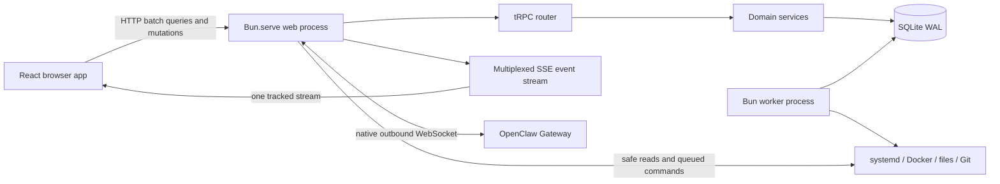

# Greenfield Rewrite Application Architecture

[Back to the blueprint map](../greenfield-rewrite.md)

## Executive Decision

If Mira Dashboard were built again from an empty repository and an empty database, I would
build it as a **Bun-native modular monolith**:

- Bun remains the runtime, HTTP server, outbound WebSocket client, test runner, bundler, and
  script runner.
- `Bun.serve` owns the process and delegates the controlled application API to tRPC's Fetch
  adapter.
- tRPC owns all queries, mutations, and subscriptions used by the browser and our TypeScript
  automations.
- The browser receives live updates over one multiplexed tRPC SSE subscription. It does not
  open a separate application WebSocket.
- The Phase 2 bootstrap verifier uses Bun's native `WebSocket` client for one current-protocol
  OpenClaw Gateway handshake. The persistent Gateway connection remains a Phase 4 target.
- Valibot owns transport, persistence, generated JSON Schema, tests, and documentation schemas.
  Effect Schema is limited to server-internal typed/tagged errors and does not replace Valibot at
  those boundaries.
- Effect owns server orchestration where typed errors, cancellation, retries, concurrency, or scoped
  resources materially improve correctness. Pure domain functions remain ordinary TypeScript.
- Each long-lived Bun process that needs Effect services owns one eagerly initialized managed
  runtime at its composition root. Requests and modules reuse it; they never construct ad hoc
  runtimes. The web process and separate worker are processes, not multiple HTTP servers.
- In the browser, Valibot validates transport, form, URL, persisted-state, and browser API
  boundaries. Effect is reserved for headless long-lived workflows such as streaming,
  cancellation/reconnect races, and resource cleanup; TanStack Query continues to own ordinary
  request caching, invalidation, and retry, and React components do not start ad hoc Effect runtimes.
- SQLite remains the durable store through `bun:sqlite`, with Drizzle as the typed schema/query
  layer and full parameterized SQL/native-driver access where needed.
- React 19 and the TanStack stack remain, but state ownership is made explicit instead of
  treating every kind of state alike.
- A separate Bun worker owns scheduled and privileged jobs. The web process validates and
  enqueues them.
- API, realtime, database, route, configuration, and runtime reference documentation is
  generated and exposed through a new `/docs` page.
- Releases are immutable, record an exact Bun revision, and are activated atomically.

This design deliberately has **no REST compatibility layer, legacy WebSocket protocol,
dual database schema, compatibility views, old payload parsers, or runtime fallback path**.
It contains no legacy importer or old-to-new data migration. Any durable data worth retaining
is recreated manually after cutover through the new system.

## Requirements and Non-goals

### Hard requirements

1. Every current user-visible Dashboard function must still work, including chat streaming,
   reconnect recovery, task automation, notifications, deployment controls, authentication,
   files, logs, Docker, database views, reports, and background jobs.
2. Bun remains the runtime, server, test runner, bundler, and script runner.
3. `oxlint` and `oxfmt` remain the linter and formatter.
4. Production stays suitable for the current single VPS and single-operator trust model.
5. Resource use must be bounded so a build, test, job, or event stream cannot consume the
   host unchecked.
6. Secrets must never enter generated documentation, logs, command arguments, Git, or API
   payloads intended for the browser.

### Deliberate non-goals

- API or database backward compatibility.
- A public multi-tenant platform.
- Microservices, Kubernetes, Redis, Kafka, NATS, or a separately deployed API gateway.
- GraphQL or gRPC as the primary browser API.
- A Node `ws`, Socket.IO, Express, Hono, Nest, Next.js, or Vite server.
- An ORM style that hides generated SQL, owns production startup, or prevents direct
  SQLite-specific operations.
- Automatic schema push/synchronization against production.
- One global frontend store containing server state, form state, route state, and UI state.
- Custom mirroring or a repository-wide source-revision pin for Bun Canary. CI qualifies the
  selected channel, while each immutable release records its resolved revision.

## Decision Record

| Area                     | Greenfield choice                            | Why                                                                                                                   |
| ------------------------ | -------------------------------------------- | --------------------------------------------------------------------------------------------------------------------- |
| Runtime/server           | Bun 1.4 Canary channel + `Bun.serve`         | Keeps the proven Bun-native deployment model and removes framework duplication.                                       |
| Application API          | tRPC v11 Fetch adapter + SuperJSON           | Browser and automations are permanently TypeScript; end-to-end contracts and selective rich types provide real value. |
| Browser realtime         | tRPC SSE with `tracked()` event IDs          | Native Fetch transport, automatic reconnect, resumable events, and no Node WebSocket adapter.                         |
| Gateway transport        | Bun native outbound `WebSocket`              | OpenClaw Gateway is already a WebSocket protocol and remains an external integration boundary.                        |
| Validation               | Valibot + Standard Schema                    | Owns transport, persistence, generated JSON Schema, tests, and documentation.                                         |
| Server effects           | Effect 4                                     | Typed errors, structured cancellation, bounded schedules, concurrency, and scoped resource lifetime.                  |
| Database                 | SQLite WAL via `bun:sqlite` + Drizzle        | Typed schema/common queries without giving up raw SQL, native PRAGMAs, backup, or migration control.                  |
| Client server-state      | TanStack Query                               | Queries, mutations, invalidation, retry, and cached-error behavior.                                                   |
| Live entity state        | TanStack DB Query Collections, selectively   | Normalized incremental writes for collections that genuinely receive live entity deltas.                              |
| Cross-route client state | Small TanStack Store domains                 | Suitable for chat runtime and connection state without a generic mega-store.                                          |
| Forms/routes             | TanStack Form + Router                       | Typed form and URL state with Valibot support.                                                                        |
| Documentation            | Explicit contract registries + Bun generator | Deterministic docs without relying on tRPC private internals.                                                         |
| Processes                | Bun web + Bun worker                         | Isolates latency-sensitive requests from privileged and resource-heavy jobs.                                          |
| Deployment               | Immutable artifact + paired DB snapshot      | Predictable activation and safe rollback without schema compatibility code.                                           |

## Target Architecture



The architecture is a modular monolith, not a distributed system. Domain transactions and
their realtime outbox records live in the same SQLite database. The web process owns browser
connections and the Gateway connection. The worker owns durable execution. Both share domain
code and the database, but only the worker receives adapters capable of long-running or
privileged mutation.

## Source Layout and Boundaries

The paths below are relative to the self-contained future repository root, currently staged as
`greenfield/`. Cutover promotes that directory's contents to the repository root; it does not
merge source trees or preserve imports to the old implementation. Use one private Bun package and
explicit source boundaries instead of publishable internal packages:

```text
src/
  app/
    dashboardServer.ts        # production domain/adaptor composition root
    server.ts                 # generic Bun.serve + process-runtime lifetime
    trpcHttpHandler.ts        # raw request policy and tRPC Fetch dispatch
    worker.ts                 # worker composition root
    browser.tsx               # React composition root
  contracts/
    registry.ts               # public contract metadata
    errors.ts
    events.ts
    <domain>.ts               # browser-safe Valibot schemas and types
  server/
    trpc/
    rawHttp/
    domains/<domain>/         # repository, service, procedures, events
    database/                 # Drizzle schema, native client, transactions
    platform/                 # auth, gateway, jobs, files, observability
  worker/
    jobs/
    adapters/                 # Docker, Git, systemd, backup, OpenClaw actions
  browser/
    routes/
    features/<domain>/
    collections/
    state/
    ui/
  shared/                     # environment-neutral pure utilities only
migrations/
scripts/
docs/
  generated/
```

Architectural dependency rules:

- browser code may import `contracts`, `browser`, and safe `shared` modules only;
- contracts may not import server, browser, filesystem, environment, or database code;
- the web composition root may not import privileged worker adapters;
- domain services do not accept `Request`, `Response`, tRPC, or SQLite objects directly;
- repositories own SQL; procedures own transport mapping; services own business rules;
- no broad barrel file may accidentally pull server code into the browser bundle; and
- bounded tooling catalogs such as `database/schema/drizzleSchema.ts` are named explicitly and
  imported only by Drizzle Kit or a database composition root. Domain modules import tables and
  validators directly.

TypeScript uses two compiler graphs behind one three-file solution. `tsconfig.json` owns all shared
strict compiler rules, has `files: []`, and references the browser and Bun child configurations.
Both children extend it. `tsconfig.bun.json` checks server, worker, scripts, and non-browser tests
with Bun/Node types and `ESNext` without DOM. `tsconfig.browser.json` adds only the DOM, JSX, narrow
type declarations, browser source, and browser-test membership it needs. There is no
server-specific config or per-role configuration proliferation.

An authoritative Babel-AST policy check discovers JavaScript, JSX, ESM/CJS, and TypeScript
extension variants across `src`, repository scripts, and the reviewed root configurations for
Drizzle and Tailwind. It permits `.tsx` only in the strict browser graph and `.ts` in every other
scanned role, rejects unknown root executables and top-level source directories, and requires
reviewed relative extensions resolving to exact contained targets. The same binding-aware analysis
classifies every composition root, enforces the dependency directions above, and rejects
nonliteral production loads, unreviewed module schemes and aliases, runtime environment escape
paths, code/module loaders, and process-execution authorities outside their explicit roles.
Source-tree symlinks and imports outside the future root are prohibited. Fast Oxlint restrictions
provide earlier feedback for supported import and global patterns; the AST check is the path-aware
policy gate for the source surfaces it explicitly scans, not a replacement for runtime sandboxing.
The browser and worker roles are already classified even where their composition remains future
work.

## Application API

### tRPC owns the controlled API

Every application operation controlled by this repository becomes a tRPC procedure:

- tasks, agents, sessions, chat, reports, incidents, and notifications;
- scheduled jobs and OpenClaw cron metadata;
- delivery, pull requests, releases, deploy, preview, and rollback;
- settings, authentication, MFA, WebAuthn, and session administration;
- Docker inventory, updater policy, and actions;
- database, cache, quota, backup, and log-rotation operations;
- Moltbook, STT, TTS, files, logs, terminal helpers, and exec jobs; and
- TypeScript automation calls from OpenClaw scripts.

The browser uses `@trpc/tanstack-react-query`, a singleton `QueryClient`, and a singleton
`createTRPCOptionsProxy`. Queries and mutations use `httpBatchLink`; subscriptions use
`httpSubscriptionLink` selected through `splitLink`. The server and every batch, subscription,
browser, and automation client configure the same SuperJSON transformer.

Automation scripts import the same `AppRouter` client type. They authenticate with scoped,
high-entropy bearer credentials whose validators are hashed at rest. There is no second REST
contract for automation merely because the caller is non-browser TypeScript.

### Browser-managed automation security

The `automationSecurity` namespace owns the complete operator-managed principal and credential
lifecycle. Its explicit contract registry contains eight procedures:

- `listPrincipals` and `listCredentials` are browser-session-only queries with stable
  creation-time/ID cursors; and
- `createPrincipal`, `createCredential`, `rotateCredential`, `revokeCredential`,
  `replaceCapabilities`, and `disablePrincipal` are browser-session-only mutations that require
  recent MFA.

An automation principal cannot administer this namespace, even if it has every registered
application capability. Each mutation revalidates the operator session, authentication version,
MFA state, and recent-MFA timestamp after acquiring its SQLite immediate-transaction lock. The
request-context snapshot is an early transport guard, not the authorization decision for the
state change.

`capabilityProcedure(capability)` remains the reusable boundary for ordinary application
procedures. It accepts a browser session or an automation principal only when the authenticated
snapshot contains that exact registered capability; there is no wildcard or capability-prefix
inheritance. The automation-administration routes deliberately use the stricter session-only
boundary instead.

Automation lifecycle policy, CSPRNG, SHA-256 derivation, and the short synchronous SQLite units of
work stay ordinary TypeScript. They neither wait on external resources nor benefit from a new
Effect service. Effect remains responsible for the process orchestration that actually needs
cancellation, deadlines, bounded asynchronous concurrency, or scoped lifetime; a route being
`async` is not by itself a reason to move it into Effect.

### Native Gateway bootstrap verification

First-user bootstrap composes a one-shot Bun-native WebSocket verifier rather than accepting an
arbitrary injected production callback. Its protocol shape was audited against the OpenClaw
version installed on the target host on 2026-08-06: `2026.7.2-beta.7 (dabe191)`. The audit used
the installed v4 protocol document and compiled client/server protocol exports, not legacy
Dashboard code.

The verifier accepts only an explicit direct-loopback root endpoint,
`ws://127.0.0.1:<port>/` or `ws://[::1]:<port>/`; remote, DNS, `wss://`, path, query, userinfo, and
fragment forms fail composition. The native upgrade sends no Origin, authorization, forwarding,
or WebSocket-subprotocol header, and the credential never appears in the URL.

Protocol v4 accepts text JSON frames only. The verifier permits exactly one `connect.challenge`
text frame of at most 4 KiB, sends one device-less local-backend v4 `connect` request with the
submitted credential, and then permits exactly one matching text response up to the installed
protocol's current 25 MiB hello limit. Binary data, unknown event or frame types, duplicate
challenges, response-before-challenge, wrong response IDs, contradictory response shapes, and
every frame outside that active two-frame flow fail immediately instead of being ignored. The handshake requests
`operator.admin` only because the current protocol reveals `snapshot.authMode` at that scope. The
verifier never sends a post-connect RPC.

Success requires the matching protocol-4 `hello-ok`, operator role, negotiated
`operator.admin`, and `snapshot.authMode: "token"`; an auth-disabled Gateway cannot validate an
arbitrary candidate. A structured `AUTH_TOKEN_MISMATCH` is the only invalid-credential result.
Malformed, oversized, duplicated, mismatched, incompatible, closed, or otherwise rejected flows
become one redacted unavailable result. `startup-sidecars` is unavailable rather than an internal
retry signal. The verifier never reconnects or retries; the operator/client must repeat the whole
HTTP bootstrap request under durable cooldown. The candidate credential is never persisted or
logged.

The native adapter remains Promise-facing. The process `ManagedRuntime` owns its separate bounded
admission, active-work lifetime, cancellation, and deadline through the authentication Effect
service. Once a socket exists, success, invalid credential, setup failure, transport error, and
abort only initiate close. The Promise, and therefore the Effect permit, settles after native
socket close is actually observed. This deliberately does not turn short synchronous policy,
parsing, hashing, or SQLite transactions into Effect programs.

The 4 KiB and 25 MiB application checks run after Bun's native WebSocket has allocated the inbound
wire frame. Literal-loopback composition, the installed Gateway's own limits, and bounded
concurrency constrain that residual allocation exposure; these are not pre-allocation frame caps.

This is **not** the Phase 4 persistent Gateway client. Before implementing persistent connections,
sessions, chat, Gateway events, or cron integration, inspect the then-installed OpenClaw source and
protocol again. Current-production Gateway/chat/session/agent/cron code supplies parity evidence,
not protocol authority. The consolidated controls and executable evidence are in the
[Phase 2 threat model](../../security/greenfield-phase-two-threat-model.md).

### Current-protocol Control UI projections

The 2026-08-06 OpenClaw audit separates protocol authority from Control UI projection through 23
hash-pinned, redacted distribution artifacts. The current behavior informs Phase 4, but Dashboard
must re-audit the installed source and use a typed protocol adapter rather than scrape, import, or
mirror Control UI implementation details:

- plan/checklist state is projected from generic `agent` events and retained only on the active
  in-flight run; it is not a durable plan record or a dedicated plan RPC;
- companion ask is labeled with `operator.read` upstream but starts new compute and is constrained
  by process-local TTL and concurrency caps. Dashboard treats it as an explicit compute action,
  preserves those bounded semantics, and does not cache it as read-only state;
- the background-task ledger supports list, detail, and cancellation. Cancellation is a write/admin
  operation, can lose a race to normal completion, and must expose that result instead of claiming
  a task was stopped; and
- `cancelled` and `timed_out` remain distinct protocol states even when a presentation groups both
  with failures.

The Phase 4 browser surface exposes the active plan/checklist, companion ask, and background-task
details/cancellation through that adapter, with authorization and race behavior covered by recorded
fixtures. These projections complement the persistent Dashboard chat journal; they do not make
ephemeral OpenClaw in-flight state durable by inference.

### Raw HTTP exists only for protocol edges

The explicit raw-route registry owns requests whose semantics are HTTP rather than domain RPC:

- `/api/health/live` and `/api/health/ready`;
- built frontend assets and SPA navigation fallback;
- range-aware file/media download and `Content-Disposition` responses;
- upload streams where buffering into a tRPC JSON body would be harmful;
- third-party webhook, OAuth callback, or redirect protocols if introduced;
- pull-request preview proxying where HTTP headers and streaming must remain transparent.

These routes use the same authentication, capability, provenance, audit, rate-limit, error,
and response-header policy as tRPC. They are not a parallel REST application API.

### Contract definition

Do not derive documentation by reading private tRPC `_def` fields. Each procedure is declared
through an explicit registry entry which contains:

- stable procedure name and query/mutation/subscription kind;
- domain and summary;
- public, session, recent-auth, or capability authorization policy;
- Valibot input and output schemas;
- request batching, body-budget, and handler-timeout policy;
- expected error codes; and
- stable client-action reasons when an authentication policy failure requires a specific flow.

The same schema objects are passed to `.input()` and `.output()`. tRPC may deliberately expose
SuperJSON-supported values such as `Date`, `Map`, `Set`, or `BigInt` when the richer type improves a
specific contract and its documentation representation is explicit. This is not a universal storage
codec: database payloads, idempotency/hash inputs, migrations, and the durable realtime journal stay
canonical plain JSON. Contracts continue to prefer epoch milliseconds or explicit ISO strings when
the richer runtime type adds no value.

### Errors and context

The Bun `fetch` boundary creates one request ID before URL routing so application-handled health,
readiness, not-found, tRPC, raw rejection, and sanitized defect responses share the same
correlation header. Every dispatch records exactly one terminal HTTP outcome event:
`http.response.created` for a returned response, `http.request.failed` for a sanitized raw-handler
defect response, or `http.request.cancelled` for client cancellation. A tRPC defect may additionally
emit one correlated `trpc.request.defect` diagnostic before the outer boundary returns and records
the sanitized `500` response; that diagnostic does not replace or duplicate the terminal HTTP
outcome. For SSE the response-created event marks
successful dispatch, not stream termination; close/cancel/error observability remains part of the
browser/realtime lifecycle slice. Client cancellation is informational and carries neither a
failure fingerprint nor a server-error outcome. Bun's outer 640 KiB pre-dispatch body ceiling
supports the largest reviewed task-content request and may reject before application correlation
exists. The raw tRPC boundary selects exact registered-procedure ceilings before parsing or
authentication: 16 KiB for authentication, 32 KiB for WebAuthn, 64 KiB by default, 128 KiB for
task progress, and 640 KiB for task create/content update. Unknown procedures retain the default
ceiling, while unknown authentication-namespace procedures retain the stricter authentication
profile. The raw handler receives the generated ID and resolves direct-client provenance against
the exact trusted-proxy allowlist before context construction. `createContext` then authenticates the
already parsed session or automation credential and establishes identity plus audit correlation
once. Reusable procedure builders are limited to:

- `publicProcedure`;
- `sessionProcedure`;
- `recentAuthProcedure`; and
- `capabilityProcedure(capability)`.

Expected errors use a small stable code set such as `UNAUTHORIZED`, `FORBIDDEN`, `CONFLICT`,
`NOT_FOUND`, `PRECONDITION_FAILED`, `TOO_MANY_REQUESTS`, and `SERVICE_UNAVAILABLE` with safe
structured details. The `ContractErrorCode` union, all 36 actual router paths, the server-owned
runtime allowlist, and generated contract metadata must match exactly. The base procedure
middleware enforces that allowlist for immediate and deferred subscription failures; an
implemented procedure missing from the policy or an undeclared code becomes a redacted internal
defect. Framework-owned routing and input/transport validation remain implicit. Stack traces,
command output, filesystem paths, and upstream secrets never enter client error shapes.

Server orchestration represents expected failures as tagged Effect errors in the typed error
channel. The tRPC boundary exhaustively maps those internal tags to the stable client code set;
unknown defects and internal `cause` values may be logged only through a redaction boundary and are
never serialized to clients. One caller-supplied process logger is installed as the only logger on
the application `ManagedRuntime` and exposed by `ApplicationRuntime` to ordinary TypeScript
boundaries. Event-specific allowlists drop unknown fields and Effect messages/annotations; runtime
disposal precedes the logger's idempotent flush.

The production web `DashboardApplicationRuntime` coordinates two eagerly initialized,
process-owned scopes. A retained database `ManagedRuntime` loads and verifies the release migration
graph before opening one fixed private state file, configures and verifies the connection policy,
and constructs Drizzle from that retained native handle. A separate application `ManagedRuntime`
owns the structured logger, database-backed realtime pump, and process-scoped authentication-work
service. The composition root obtains the same ORM and bounded write-admission port for every
domain repository; the realtime layer depends on that retained database service. Shutdown disposes
the application scope before the database scope, so realtime and every claimed durable
authentication settlement finish before SQLite is checkpointed and closed. The narrower generic
runtime factory remains available for focused service and transport tests with an injected realtime
layer.

The authentication service owns separate bounded admission and active-work semaphores for Gateway
verification, password/Argon2 work, TOTP AES/HMAC work, and WebAuthn parsing/signature
verification, plus a scoped fiber set for work that outlives an interrupted caller. Queued
cancellation releases admission immediately; active non-cooperative work retains its permit until
settlement. Promise-facing adapters fold typed capacity into explicit domain throttling outcomes,
while Gateway capacity, deadline, and unavailable tags are exhaustively translated before the
tRPC procedure maps the resulting domain outcome. No request creates or disposes a database or
runtime.

The application `ManagedRuntime` coordinates listener shutdown. An external `stop(true)` request crosses
the Promise-facing composition boundary as an abort signal; Effect owns the graceful-stop fiber,
deadline/force race, tagged stop and timeout failures, separately bounded force attempt, and
settlement of the original graceful operation before the runtime scope is disposed. A rejected
graceful stop receives one bounded best-effort force attempt while preserving the initiating
failure. No request-local runtime or manual timer/`Promise.race` shutdown system is created.
After listener settlement, runtime finalization closes realtime, passively checkpoints and strictly
closes SQLite, and only then flushes the process logger. If listener escalation cannot prove
settlement, the server keeps both runtime scopes alive for supervisor containment rather than
closing a database beneath potentially active requests.

## Realtime Architecture

### One browser stream

Each authenticated browser tab opens one `events.stream` tRPC SSE subscription containing the
topics it currently needs. Route changes update the subscription input rather than opening a
connection per widget. Browser-to-server actions, including chat send/cancel/retry/steer, stay
ordinary tRPC mutations. SSE is intentionally one-way.

The authenticated transport derives or authorizes every requested topic before invoking the pump.
A caller-supplied topic filter narrows delivery only; it is never an authorization mechanism.

The stream uses same-origin credentials, Origin and Fetch Metadata checks, periodic comments
or pings, an abort-aware iterator, bounded per-client buffering, and explicit slow-consumer
disconnect. Tokens never appear in the URL. Reconnect uses tRPC `tracked()` IDs.

### Durable transactional outbox

Every durable domain mutation writes its state change and a `realtime_events` row in the same
SQLite transaction:

```text
realtime_events
  id                INTEGER PRIMARY KEY AUTOINCREMENT
  topic             TEXT NOT NULL
  entity_type       TEXT NOT NULL
  entity_id         TEXT NOT NULL
  operation         TEXT NOT NULL
  payload_json      TEXT NOT NULL CHECK (json_valid(payload_json))
  occurred_at_ms    INTEGER NOT NULL
  expires_at_ms     INTEGER NOT NULL
```

`id` is the global resume cursor. `(topic, id)` supports filtered catch-up. The event pump
queries in bounded pages, validates stored payloads, and emits `tracked(String(id), event)`.
In-process mutations wake the pump immediately. Cross-process worker changes are discovered by
a single adaptive database poll, fast only while browsers are connected and backed off while
idle. Retryable `SQLITE_BUSY*` reads use a bounded exponential backoff; non-retryable or exhausted
failures terminate affected subscriptions explicitly. This is simpler and safer on one host than
introducing a broker.

Initial load and reconnect are gap-free:

1. A snapshot query returns entities plus the outbox cursor observed in the same read
   transaction.
2. The subscription requests events after that cursor.
3. Because the outbox is durable, events committed between those requests are caught up.
4. Event IDs are monotonically deduplicated before applying changes.
5. If retention has removed the requested cursor, the server emits `resync-required` and the
   client replaces its snapshot instead of guessing.

Outbox retention is time- and count-bounded and cannot delete below the oldest cursor still
needed by a connected client. Metrics expose oldest/newest IDs, retained rows, catch-up batch
size, subscriber lag, reconnects, failed poll attempts, scheduled retryable poll retries, dropped
slow clients, and forced resyncs.

### Chat event handling

The Gateway remains authoritative for sessions and final conversation history. Dashboard owns
an explicit local runtime state machine for active work:

- `chat_runs` records the request boundary, Gateway scope/session, state, model/settings,
  cancellation, and final reconciliation status;
- `chat_run_events` stores ordered, validated runtime events with a unique run/sequence key;
  and
- `chat_runtime_snapshots` stores the latest compact projection needed for fast restart
  recovery.

Gateway token and thinking deltas are coalesced into ordered 150 ms batches before a SQLite
transaction and SSE emission. The interval matches the audited OpenClaw source throttle and is the
smallest candidate that meets the measured write-rate, visual-delay, and crash-window policy for
one, four, and eight concurrent runs. Tool/item boundaries, terminal deltas, cancellation, and
completion flush immediately; the design never performs one durable commit per token. A final
Gateway history fetch reconciles the runtime projection without duplicating messages. On restart,
Dashboard restores the snapshot and remaining journal, reconnects to Gateway, and reconciles
again.

This state machine must retain all current behavior: token streaming, thinking and tool row
ordering, tool failure scoping, final-message reconciliation, cancel/retry, concurrent sends,
steering, attachments, model/thinking/speed/compaction controls, session switching, history
pagination, deleted-row aliases, unread/follow/scroll behavior, and restart recovery.

## Frontend Architecture

### State ownership

| State kind                | Owner                         | Examples                                                            |
| ------------------------- | ----------------------------- | ------------------------------------------------------------------- |
| URL/navigation state      | TanStack Router               | route, selected chat session, filters, search, settings tab         |
| Ordinary remote state     | TanStack Query                | reports, settings, backups, metrics, file reads, release details    |
| Live normalized entities  | TanStack DB Query Collections | tasks, agents, sessions, notifications, selected job/event lists    |
| Mutations                 | tRPC + TanStack Query         | create/update/delete/action calls and precise invalidation          |
| Forms                     | TanStack Form                 | settings, auth, job intent, task edit, deploy forms                 |
| Cross-route runtime state | Small TanStack Store domains  | chat runtime, connection health, persisted chat display preferences |
| Ephemeral component state | React state                   | open popover, selection, draft-local affordances                    |

Authentication state is a server query, not a manually synchronized global auth store. A
small connection store may expose SSE/Gateway health without owning domain data. Chat gets its
own reducer/state-machine store because its ordered transient events must survive route changes
and reconnects. It is not combined with general server cache state.

### Browser Effect boundary

Effect is available in the browser, but the same selective boundary applies as on the server.
TanStack and React continue to own rendering, server-state caches, normalized collections,
forms, URL state, and ordinary component state. Effect owns browser work only when asynchronous
lifetimes are themselves part of the correctness contract: scoped subscriptions or streams,
coordinated cancellation, bounded queues/concurrency, explicit retry/backoff, multi-step uploads,
and tagged operational failures.

The first browser feature that needs such orchestration creates one browser-composition runtime
and disposes it during application/test teardown. Hooks and renders never create runtimes, fibers,
or duplicate retry loops. An Effect service publishes stable snapshots into the owning TanStack
Store, Query, or collection boundary; it does not become a second domain-state cache. Simple tRPC
query functions, Valibot parsing, reducers, deterministic state transitions, and individual event
handlers remain ordinary TypeScript. Existing tRPC/TanStack cancellation and retry behavior is
reused rather than wrapped merely because a function is asynchronous.

### Evaluated browser dependency candidates

The following registry/documentation review was performed on 2026-08-06. It records candidates,
not blanket installation approval. Every adopted pre-1.0 package is exact-pinned and requalified in
the vertical slice that first needs it; competing libraries are not shipped together.

| Candidate                                      | Current decision                                                                                                                                                                                                                                                                                              |
| ---------------------------------------------- | ------------------------------------------------------------------------------------------------------------------------------------------------------------------------------------------------------------------------------------------------------------------------------------------------------------- |
| `react-resizable-panels` `4.12.2`              | Likely adoption for accessible chat, file, log, and terminal split panes. Add it only with the first real pane layout, keyboard/focus tests, bounded persisted sizes, responsive fallback, and teardown evidence.                                                                                             |
| TanStack Markdown `0.0.13`                     | Alpha replacement candidate for the current `react-markdown`/remark/rehype chain. Before adoption, replay the complete chat/report/file corpus and verify the required GFM subset, accumulated AI streaming, unsafe HTML/URL handling, deterministic rendering, and bundle delta.                             |
| TanStack Highlight `0.0.10`                    | Alpha companion candidate for Markdown and code/file previews. Qualify the explicit language registry, embedded-language fidelity, line/range annotations, escaping, themes, and bundle delta against the current `react-syntax-highlighter`/`refractor` surface. Adopt Markdown and Highlight independently. |
| TanStack Charts + React adapter `0.6.5`        | Preferred typed/accessibility candidate for Phase 3 metrics, but still pre-alpha. Compare representative time-series, categorical, tooltip, resize, keyboard, theme, export, and high-point-count cases against Recharts before selecting exactly one renderer.                                               |
| Recharts `3.10.1`                              | Mature fallback if the TanStack Charts spike fails. Its larger dependency surface, including Redux infrastructure, must be justified by concrete parity or stability evidence; it is not installed alongside TanStack Charts.                                                                                 |
| TanStack Pacer / React Pacer `0.21.1`/`0.22.1` | Beta candidate only for repeated browser timing needs such as observable debounce, throttle, and UI batching. Server/process concurrency remains Effect-owned. The transitive `@tanstack/pacer-lite` used by TanStack DB is not an application API or reason to add the full package.                         |
| Motion `13.0.0`                                | Optional later dependency for complex gesture, shared-layout, or interruptible animation parity. CSS/Tailwind remains the default; any adoption uses the current `motion` entry point, route-level code splitting, and reduced-motion tests rather than a direct legacy `framer-motion` import.               |
| `react-refresh` `0.18.0`                       | Not an application/runtime dependency. A future qualified custom HMR development path may own it as build tooling; the selected production AOT build does not ship it.                                                                                                                                        |
| SWR `2.5.0`                                    | Rejected. It duplicates tRPC/TanStack Query remote-state ownership and would introduce a second cache, retry policy, and invalidation model.                                                                                                                                                                  |

### What Query Collections are for

A TanStack DB Query Collection is the bridge from a TanStack Query snapshot to a normalized,
reactive entity collection. It is useful when a page needs entity-level incremental updates,
live filtering, local joins, or stable row identity. The initial `queryFn` returns the complete
authoritative snapshot and forwards its `AbortSignal`; SSE then applies validated deltas with
`writeInsert`, `writeUpdate`, `writeDelete`, `writeUpsert`, or one `writeBatch`.

It is not used merely because data came from the server:

- reports and configuration stay normal queries;
- a log byte stream stays a bounded stream buffer;
- a single health document stays a query;
- form drafts stay in TanStack Form; and
- chat runtime events stay in the dedicated chat store/state machine.

Collections are created once per `QueryClient` and cache key and hidden behind a small Dashboard
adapter because TanStack DB is still pre-1.0. The exact-qualified package set is
`@tanstack/db@0.6.17`, `@tanstack/query-db-collection@1.2.1`,
`@tanstack/react-db@0.1.95`, and `@tanstack/query-core@5.101.4`. Route teardown disposes only the
route subscription; it does not destroy and recreate an asynchronous collection under the same
cache key. A server snapshot always wins over conflicting speculative collection state.

### Component and route rules

- Keep the current public route paths and query-string behavior unless a separately approved
  UI change intentionally replaces them.
- Use code-based, domain-split lazy routes; do not introduce a Vite-only route generator.
- Route loaders prefetch only critical data and reuse the singleton QueryClient.
- Feature modules own their query option factories, mutation option factories, collection
  adapter, components, and tests.
- Shared UI contains presentation primitives, not domain-specific orchestration.
- React Compiler remains enabled. Manual memoization is used only where stable identity is an
  external contract and a profiler or test justifies it.
- Lists with unbounded rows use TanStack Virtual; tables use TanStack Table; neither becomes a
  general state manager.
- Cached successful data remains visible through transient refresh failures, with a local
  non-blocking warning.
- Accessibility, keyboard behavior, focus restoration, responsive behavior, and reduced
  motion are parity requirements, not cleanup work for later.

## Frontend Functional Parity Contract

The rewrite may replace every component, store, hook, and API call, but it is incomplete until
the following behavior is covered by automated tests and a manual parity checklist.

| Surface       | Required behavior after rewrite                                                                                                                                                                     |
| ------------- | --------------------------------------------------------------------------------------------------------------------------------------------------------------------------------------------------- |
| Global shell  | Authentication boundary, responsive navigation, theme/layout behavior, notification bell/modal, connection status, errors, and route recovery.                                                      |
| `/`           | Health, agent, task, job, notification, Docker, Git, database, quota, weather, and operational overview cards retain cached values through transient refresh errors.                                |
| `/tasks`      | Kanban/list behavior, create/edit/delete, status and assignee movement, labels, updates, automation configuration, full current search/filter semantics, and live deltas.                           |
| `/agents`     | Agent state, metadata, current task, history, status transitions, and live updates.                                                                                                                 |
| `/sessions`   | Gateway session listing, filtering, metadata, actions, refresh, and live state.                                                                                                                     |
| `/chat`       | All streaming, thinking/tool display, cancel/retry/steer/concurrent send, history, attachment, settings, session, unread/follow/scroll, compaction, and restart/reconnect behavior described above. |
| `/logs`       | Safe root selection, file listing, tail/follow, bounded streaming, search/display controls, rotation state, and non-blocking errors.                                                                |
| `/jobs`       | Dashboard schedules, OpenClaw cron jobs, enable/disable intent and expiry, run history, manual run/cancel, worker state, output, and aggregate counts.                                              |
| `/reports`    | Daily briefs, summaries, heartbeats, custom reports, filters, pagination/detail linking, Markdown display, cached refresh behavior, and incident links.                                             |
| Notifications | Read/unread behavior, source links, filtering, badges, and exactly-once notification per active incident generation.                                                                                |
| `/delivery`   | PR review queues, trusted PR development, previews, release records, deploy/rollback actions, progress, blocking reasons, and retention.                                                            |
| `/files`      | Safe workspace browsing, edit/save, upload/download/preview, Markdown/code rendering, path policy, and conflict/error handling.                                                                     |
| `/docker`     | Inventory, independently refreshed live stats, managed update policy, checks/actions, history, console commands, and duplicate-submit prevention.                                                   |
| `/database`   | PostgreSQL/PgBouncer and Dashboard SQLite views, source picker, metrics, maintenance assessment/actions, cached fallback, and balanced layout.                                                      |
| `/moltbook`   | Cached/API data, refresh behavior, status and error presentation, and existing actions.                                                                                                             |
| `/settings`   | Persistent OpenClaw/Dashboard tab, OpenClaw configuration, password, WebAuthn/passkeys, TOTP, recovery codes, browser sessions, secret handling, and restart actions.                               |
| `/terminal`   | Command helper/completion flow, history/output behavior, safety policy, cancellation, and narrow-screen interaction.                                                                                |
| Media/STT/TTS | Existing upload constraints, MIME normalization, preview/download, transcription, speech generation, and scoped errors.                                                                             |
| New `/docs`   | Generated procedure, raw HTTP, realtime, database, configuration, runtime, package, and route references, searchable without exposing secrets.                                                      |

The existing API endpoint list is an input to the parity inventory, not a contract to preserve.
Each old endpoint must map to a new procedure, a raw protocol route, or an explicit removal
reason showing that no current frontend or automation behavior depends on it.
